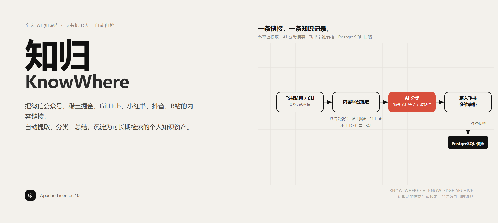

# 知归（KnowWhere）

> 让散落的信息汇聚起来，沉淀为自己的知识。

知归是一个面向个人使用的 AI 知识归档工具。把内容链接发送给飞书机器人，知归会自动完成内容提取、AI 分类与总结，并将结果沉淀到飞书多维表格中。

## 为什么做知归

在信息爆炸的时代，我们可以从微信公众号、技术社区、开源项目和内容平台持续获取高质量知识，但这些信息往往散落在收藏夹、聊天记录和不同 App 中：收藏很容易，回顾很困难；信息越来越多，真正沉淀下来的知识却很少。

知归希望解决的不是“再找一个地方收藏链接”，而是把零散内容转化成可以长期检索、分类、阅读和复用的个人知识资产：

1. 在平时最顺手的入口——飞书私聊——发送链接。
2. 自动提取文章正文、仓库 README、图文内容或视频语音。
3. 用 AI 生成简短标题、分类、标签、摘要和关键观点。
4. 将原文、分析结果和阅读状态统一归档到飞书多维表格。

## 已有功能

### 支持的内容来源

| 来源 | 支持内容 | 当前处理方式 |
| --- | --- | --- |
| 微信公众号 | 公开文章 | 提取标题、作者、发布时间和正文 |
| 稀土掘金 | 公开文章 | 提取标题、作者、发布时间和正文 |
| GitHub | 公开仓库主页 | 提取默认分支根目录 README |
| 小红书 | 公开图文、视频，分享短链 | 图文按顺序进行视觉理解；视频提取音频并转录 |
| 抖音 | 公开图文、视频，分享短链 | 图文按顺序进行视觉理解；视频提取音频并转录 |
| B站 | 公开视频、分享短链、分 P | 下载 DASH 音轨并转录，不分析视频画面 |

### 内容归档

- 通过飞书官方 SDK 建立长连接，无需公网域名或 Webhook 回调地址。
- 自动创建并幂等维护“知归”多维表格、字段和常用视图。
- 保存原始标题、原始链接、作者、发布时间、完整正文或转录等来源信息。
- AI 生成简短标题、一级分类、标签、一句话摘要、详细摘要和关键观点。
- 提供收件箱、未读、按分类浏览、视频内容、失败待重试、低置信度、全文等视图。
- 新内容默认标记为“未读”，可在飞书中维护阅读状态和阅读时间。
- 直接读取飞书“一级分类”字段中的选项，因此可以在飞书中扩展自己的分类体系。

### 稳定性与可替换能力

- PostgreSQL 保存任务状态、提取正文、AI 结果和飞书归档引用。
- 使用规范链接和平台内容 ID 做幂等处理，避免重复归档。
- AI 输出经过 JSON Schema 校验；格式错误时会尝试一次修复，仍失败则明确降级。
- 媒体文件流式下载并限制大小，临时文件默认在任务结束后清理。

## 工作流程

```text
飞书私聊 / CLI
  → 识别内容平台
  → 提取文章、README、图文或视频语音
  → 视觉理解 / 语音转录（按内容类型选择）
  → 读取飞书分类目录
  → AI 生成分类与摘要
  → 写入飞书多维表格
  → PostgreSQL 保存任务快照
```

完整数据流可以查看[交互式架构图](docs/diagrams/knowwhere-dataflow.html)或[技术架构文档](docs/TECHNICAL_ARCHITECTURE.md)。

## 最小启动方式

推荐使用 Docker Compose。Compose 只运行知归本身，不会创建 PostgreSQL；开始前需要准备：

- Docker Desktop；
- 一个知归可访问的 PostgreSQL 数据库；
- 一个已发布的飞书企业自建应用；
- 一个提供 Chat Completions 接口的 OpenAI 兼容文本模型。

### 1. 配置飞书应用

在飞书开放平台创建企业自建应用并启用机器人能力，至少申请以下权限：

| 权限标识 | 用途 |
| --- | --- |
| `im:message.p2p_msg:readonly` | 接收发给机器人的私聊消息 |
| `im:message:send_as_bot` | 回复处理状态和归档链接 |
| `bitable:app` | 创建并维护多维表格与记录 |
| `docs:doc` | 管理归档所需的飞书文档能力 |
| `docs:permission.member:create` | 将使用者添加为归档空间协作者；控制台未拆分该权限时无需单独选择 |

在事件订阅中选择“使用长连接接收事件”，添加 `im.message.receive_v1`，然后创建并发布应用版本。个人使用时，建议把应用可用范围只设置为自己。

完整操作见[飞书应用配置指南](docs/FEISHU_SETUP.md)。

### 2. 填写最小配置

复制环境变量模板：

```powershell
Copy-Item .env.example .env
```

编辑 `.env`，最少填写以下 6 项：

```dotenv
KW_DATABASE_URL=postgresql+psycopg://用户名:密码@数据库地址:5432/knowwhere

KW_FEISHU_APP_ID=cli_xxxxxxxxxxxxxxxx
KW_FEISHU_APP_SECRET=xxxxxxxxxxxxxxxx

KW_LLM_API_KEY=sk-xxxxxxxx
KW_LLM_BASE_URL=https://你的模型服务地址/v1
KW_LLM_MODEL=你的模型ID
```

如果数据库密码包含特殊字符，需要先进行 URL 编码。

### 3. 启动 Gateway

```powershell
docker compose build
docker compose run --rm app init-feishu
docker compose --profile gateway up -d gateway
docker compose --profile gateway ps
```

打开飞书中的机器人私聊，发送一条受支持的内容链接。机器人会先回复接收状态，处理完成后返回飞书记录链接。

查看运行日志：

```powershell
docker compose logs -f gateway
```

停止服务：

```powershell
docker compose --profile gateway down
```

该命令只停止知归容器，不会停止或删除外部 PostgreSQL。

### 不启动机器人，直接处理链接

如果只想验证单条内容，可以通过 CLI 完成同一条归档链路：

```powershell
docker compose run --rm app process "https://mp.weixin.qq.com/s/文章ID"
```

## 可选配置

所有配置及默认值都在 [`.env.example`](.env.example) 中。以下配置只在对应能力启用时需要修改。

### 图文视觉理解

归档小红书或抖音图文时，需要同时配置：

```dotenv
KW_VISION_API_KEY=xxxxxxxx
KW_VISION_BASE_URL=https://视觉模型服务地址/v1
KW_VISION_MODEL=视觉模型ID
```

视觉接口采用 OpenAI 兼容格式，本地图片会以 Base64 形式发送给视觉模型。

### 视频语音转录

默认使用本地 `faster-whisper`，无需云端 ASR 凭据：

```dotenv
KW_ASR_PROVIDER=faster_whisper
KW_TEMP_STORAGE_PROVIDER=local
KW_FASTER_WHISPER_MODEL=small
KW_FASTER_WHISPER_DEVICE=cpu
KW_FASTER_WHISPER_COMPUTE_TYPE=int8
```

首次处理视频时会下载模型。可以通过 `KW_FASTER_WHISPER_MODEL_DIR` 指定模型缓存目录；具备可用 NVIDIA CUDA 运行环境时，可将设备改为 `cuda`、计算类型改为 `float16`。

也可以切换到腾讯云录音文件识别：

```dotenv
KW_ASR_PROVIDER=tencent
KW_TEMP_STORAGE_PROVIDER=tencent_cos

KW_TENCENTCLOUD_APP_ID=xxxxxxxx
KW_TENCENTCLOUD_SECRET_ID=xxxxxxxx
KW_TENCENTCLOUD_SECRET_KEY=xxxxxxxx
KW_COS_REGION=ap-shanghai
KW_COS_BUCKET=knowwhere-temp-1250000000
```

腾讯 ASR 必须搭配私有 COS Bucket。知归会上传临时音频、生成短时访问地址，在任务结束后按清理策略删除中转对象。

### 临时文件与媒体限制

| 配置 | 作用 |
| --- | --- |
| `KW_TEMP_LOCAL_ROOT` | 指定媒体下载、FFmpeg 和本地 ASR 的工作目录 |
| `KW_TEMP_DELETE_AFTER_PROCESS` | 是否在成功或失败后删除临时产物，默认 `true` |
| `KW_FFMPEG_PATH` | 指定 FFmpeg 可执行文件名或绝对路径 |
| `KW_*_REQUEST_TIMEOUT_SECONDS` | 调整各内容平台的请求超时 |
| `KW_*_MAX_IMAGE_BYTES` | 限制单张图片大小 |
| `KW_*_MAX_VIDEO_BYTES` | 限制单个视频大小 |
| `KW_BILIBILI_MAX_AUDIO_BYTES` | 限制 B站音频大小 |

### 使用其他配置文件

命令默认读取项目根目录的 `.env`。可以传入其他文件：

```powershell
uv run knowwhere health --env-file D:\config\knowwhere.env
```

配置优先级为：进程环境变量 > `--env-file` 指定文件 > 根目录 `.env`。

## 本地开发

本地运行需要 Python 3.12 和 [uv](https://docs.astral.sh/uv/)。处理视频时还需要 FFmpeg。

```powershell
uv sync --all-groups
uv run knowwhere migrate-and-health
uv run knowwhere init-feishu
uv run knowwhere gateway
```

常用命令：

| 命令 | 用途 |
| --- | --- |
| `uv run knowwhere health` | 校验配置和 PostgreSQL 连接 |
| `uv run knowwhere migrate-and-health` | 执行数据库迁移并检查连接 |
| `uv run knowwhere init-feishu` | 幂等创建或升级飞书归档空间 |
| `uv run knowwhere process "<URL>"` | 处理一条受支持的内容链接 |
| `uv run knowwhere gateway` | 启动飞书长连接机器人 |
| `uv run knowwhere fake-smoke` | 运行不访问网络和数据库的接线冒烟测试 |

运行项目检查：

```powershell
uv run ruff check .
uv run mypy src/knowwhere
uv run pytest
```

## 当前边界

- 只处理无需登录即可访问的公开内容，不支持私密、付费或已删除内容。
- 飞书入口面向个人私聊；一条消息只处理识别到的第一个受支持链接。
- GitHub 只接受仓库主页链接，并要求公开仓库存在可读取的 README。
- B站当前只把视频简介和语音转录作为总结依据，不理解视频画面。
- 小红书、抖音和 B站依赖平台公开页面或接口，平台结构调整可能导致提取暂时失效。
- 图文或视频归档的速度受媒体大小、网络、模型性能和 ASR 方式影响。

## 数据与隐私

- 完整正文、转录、任务状态和归档引用会保存到你配置的 PostgreSQL；整理结果会写入飞书。
- 文章正文会发送给你配置的文本模型；小红书和抖音图片会发送给你配置的视觉模型。
- 本地 `faster-whisper` 不会把音频提交给云端 ASR；腾讯 ASR 模式会通过你自己的 COS Bucket 中转音频。
- 本地临时媒体和 COS 中转对象默认在任务结束后删除，但模型缓存会保留以便复用。
- 请自行确认内容来源、模型供应商、飞书和云服务的隐私政策与使用条款。

## 项目结构

```text
src/knowwhere/domain/          领域对象与任务状态机
src/knowwhere/application/     处理流水线与供应商无关端口
src/knowwhere/adapters/        内容平台、LLM、视觉、ASR 与飞书适配器
src/knowwhere/infrastructure/  PostgreSQL 数据模型与仓储
alembic/                       数据库迁移
tests/                         离线回归测试
docs/                          产品、架构、飞书配置与数据流文档
```

## 更多文档

- [技术架构文档](docs/TECHNICAL_ARCHITECTURE.md)
- [飞书应用配置指南](docs/FEISHU_SETUP.md)
- [内容归档数据流图](docs/diagrams/knowwhere-dataflow.html)
- [第三方软件与许可证说明](THIRD_PARTY_NOTICES.md)

## License

本项目基于 [Apache License 2.0](LICENSE) 开源。使用第三方组件时，还需遵守其各自的许可证与使用条款。
