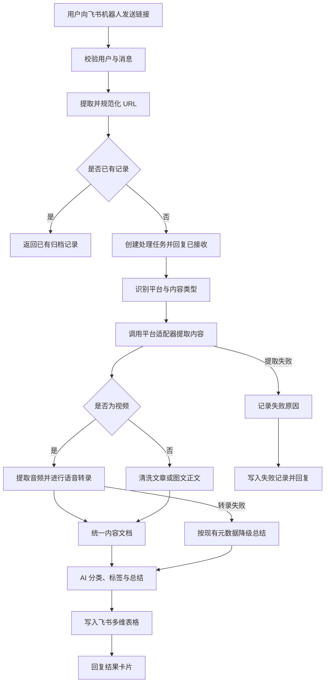

# 知归 KnowWhere 产品需求文档（PRD）

> 让散落的信息各归其位。

## 0. 文档信息

| 项目 | 内容 |
| --- | --- |
| 产品名称 | 知归 |
| 英文名称 | KnowWhere |
| 产品形态 | 飞书机器人 + AI 内容处理服务 + 飞书多维表格 |
| 文档版本 | v1.3 |
| 文档状态 | MVP 决策确认稿 |
| 创建日期 | 2026-08-27 |
| 目标发布 | MVP |
| 主要使用者 | 单一个人用户 |

### 0.1 文档目的

本文档定义知归 MVP 的产品目标、范围、功能规则、数据结构、交互流程、非功能要求和验收标准，作为后续架构设计、任务拆分、开发、测试和发布的共同基线。

### 0.2 已确认产品约束

MVP 按以下已确认决策推进：

1. 产品仅供单一个人用户使用，不建设团队协作、多用户或多租户能力。
2. 用户只通过飞书私聊机器人发送链接，不支持群聊场景。
3. 系统以 Docker 为主要部署环境，并提供可复现的 Docker Compose 部署方式。
4. LLM 通过 OpenAI 兼容接口接入，服务地址、模型名称和密钥均可配置。
5. 允许把抓取到的正文或转录文本发送给第三方云模型，但不得发送凭据和无关个人信息。
6. 飞书多维表格由系统在首次绑定个人用户时自动创建，并幂等创建“内容库”数据表、字段和默认视图；用户无需提供 `app_token`、`table_id` 或字段映射。
7. 视频不设置产品层面的最大时长，长视频必须分段处理，不得因时长直接拒绝或截断。
8. 原始音视频只作为临时处理文件，任务完成或失败后删除，不长期保存。
9. 一级分类由默认分类和用户自定义分类共同组成，用户可在系统创建的多维表格中维护分类选项。
10. 完整正文或完整转录必须保留；超过多维表格单字段容量时保存到飞书文档，并在主表中记录链接。
11. 首版支持小红书、抖音、微信公众号、稀土掘金，并为其他公开网页提供通用解析兜底。
12. 小红书和抖音解析可能依赖登录态，平台限制导致的失败必须对用户透明。
13. MVP 面向个人、低频、合法的内容收藏，不提供批量爬取、账号监控或内容搬运能力。
14. 首版 ASR 使用腾讯云录音文件识别；ASR 仍通过统一端口接入，可通过配置切换到本地服务或其他云厂商。
15. 首版使用腾讯云 COS 临时存放待识别音频分段，可复用 ASR 的腾讯云密钥；对象存储仍通过统一端口接入，可替换为本地卷、MinIO、S3 或其他对象存储。

---

## 1. 产品概述

### 1.1 一句话定义

知归是一个运行在飞书中的 AI 信息收集助手：用户把文章或视频链接发送给机器人，系统自动读取内容、生成摘要、归类打标签，并保存到飞书多维表格。

### 1.2 产品价值

知归解决的不是“收藏链接”本身，而是收藏后的三个断点：

1. **没有读完**：收藏时无暇阅读，之后也很少重新打开。
2. **无法找到**：信息散落在多个平台、聊天和收藏夹中，缺乏统一结构。
3. **难以复用**：只保存原链接，没有摘要、观点和标签，无法快速回忆价值。

知归把“看到有价值的信息”到“形成可检索知识条目”的步骤压缩为一次分享动作。

### 1.3 产品原则

1. **分享即收录**：用户不需要复制正文、选择目录或填写表单。
2. **先可靠，后聪明**：处理状态、原始链接和失败原因必须可靠保存，AI 结果可以重试和修正。
3. **分类可控**：一级分类只能来自“默认分类 + 用户自定义分类”的当前允许集合，标签允许灵活扩展，避免 AI 临时生成大量近义分类。
4. **忠于原文**：摘要只依据实际抓取或转录内容，不足时明确标记，不补写事实。
5. **失败可见**：系统不得静默丢失消息；每个任务最终必须进入成功、部分成功、重复或失败状态。
6. **平台解耦**：每个平台使用独立适配器，单个平台失效不影响其他平台。
7. **数据归用户所有**：原始链接、摘要和归档数据保存在用户控制的飞书空间中。

---

## 2. 用户与核心场景

### 2.1 目标用户

#### 核心用户：高频信息消费者

- 经常浏览小红书、抖音、微信公众号和掘金。
- 每天收藏多篇文章、图文或视频。
- 使用飞书处理工作、写作或个人知识管理。
- 希望未来能按主题重新找到材料，而不仅是保存链接。

#### 扩展用户：内容创作者与研究者

- 需要长期积累选题、案例、观点和表达素材。
- 需要对素材按平台、主题、形式和价值进行筛选。
- 希望快速查看内容摘要，决定是否深入阅读。

### 2.2 核心使用场景

1. 用户在微信公众号看到长文，将链接转发给知归，稍后在飞书中查看摘要和关键观点。
2. 用户在小红书看到图文笔记，将分享链接发送给知归，系统归入“内容与运营”并生成标签。
3. 用户在抖音看到知识类视频，将链接发送给知归，系统提取音频、转录并总结。
4. 用户连续发送多个链接，系统分别处理，不阻塞飞书对话。
5. 用户重复发送已收藏链接，系统提示已有记录并返回原记录入口。
6. 平台要求登录或触发验证时，系统保存失败记录，说明原因并提供重试方式。

### 2.3 用户故事

| 编号 | 用户故事 | 优先级 |
| --- | --- | --- |
| US-01 | 作为用户，我希望把链接发给飞书机器人后立即收到“已接收”反馈，以确认内容没有丢失。 | P0 |
| US-02 | 作为用户，我希望系统自动识别来源平台和内容类型，不需要手工选择。 | P0 |
| US-03 | 作为用户，我希望文章被自动提取和总结，以便不打开原文也能判断价值。 | P0 |
| US-04 | 作为用户，我希望视频语音被转录后再总结，而不是仅总结标题和简介。 | P0 |
| US-05 | 作为用户，我希望内容自动进入默认或自定义分类并带有若干标签，方便后续筛选。 | P0 |
| US-06 | 作为用户，我希望所有结果保存在飞书多维表格，并能直接从机器人回复跳转查看。 | P0 |
| US-07 | 作为用户，我希望重复分享时不产生重复记录。 | P0 |
| US-08 | 作为用户，我希望失败时知道失败阶段和原因，并可以重试。 | P0 |
| US-09 | 作为用户，我希望手工修改 AI 分类，且系统保留最终人工结果。 | P1 |
| US-10 | 作为用户，我希望对归档内容进行自然语言问答和语义检索。 | P2 |

---

## 3. 产品目标与成功指标

### 3.1 MVP 目标

1. 打通“飞书分享链接—内容提取—AI 总结分类—多维表格归档—飞书回执”的完整闭环。
2. 支持四个指定平台，并允许通用公开网页以降级方式处理。
3. 建立统一内容模型、任务状态和错误体系，为后续增加平台或模型保留扩展能力。
4. 让用户仅通过飞书和多维表格即可完成日常使用与问题排查。

### 3.2 成功指标

以下指标在连续处理不少于 100 条真实样本后评估：

| 指标 | MVP 目标 | 统计口径 |
| --- | --- | --- |
| 消息确认时延 | P95 小于 3 秒 | 飞书事件到“已接收”回复 |
| 可访问文章处理时延 | P95 小于 60 秒 | 接收到写入多维表格完成，不含平台验证等待 |
| 30 分钟内视频处理时延 | P95 小于视频时长的 50%，且不超过 10 分钟 | 用于短视频性能基线；更长视频按时长分桶统计，不设拒绝阈值 |
| 微信公众号、掘金可访问内容成功率 | 不低于 90% | 排除已删除、私密、必须人工验证内容 |
| 小红书、抖音可访问内容成功率 | 首版不低于 70% | 排除已删除、私密、地区限制内容 |
| 归档完整率 | 不低于 99% | 成功任务均具有链接、平台、标题、摘要、分类、状态 |
| 全文保存完整率 | 100% | 已成功提取的正文或转录在表格字段或飞书文档中完整保留 |
| 去重准确率 | 不低于 95% | 重复链接没有产生新有效记录 |
| 分类人工修改率 | 不高于 20% | 用户修改一级分类的记录占比 |
| 静默失败数 | 0 | 所有任务都有终态和可见反馈 |

成功率目标是产品目标，不代表对第三方平台可用性的承诺。平台反爬变化需单独记录和评估。

### 3.3 非目标

MVP 明确不包含：

1. 独立 Web 管理后台或移动 App。
2. 微信个人号机器人入口。
3. 平台账号、关键词或作者的定时批量监控。
4. 评论区批量采集和舆情分析。
5. 自动发布、转载或二次分发内容。
6. 完整保存所有原图、原视频的数字资产管理能力。
7. 多用户、团队协作、多租户计费、公开注册和商业化后台。
8. RAG 知识问答、语义搜索和基于收藏库的写作助手。
9. 对私密、付费、已删除或无权访问内容进行绕过式抓取。

---

## 4. 版本范围与优先级

### 4.1 P0：MVP 必须完成

- 飞书机器人接收指定个人用户私聊发送的链接。
- 单条消息解析最多 5 个链接，并分别创建任务。
- 支持微信公众号、掘金、小红书和抖音平台识别。
- 支持普通公开网页通用解析。
- 短链接跳转解析、URL 规范化和重复检测。
- 文章正文提取；视频元数据提取、音频转录。
- AI 生成一级分类、标签、一句话摘要、详细摘要和关键观点。
- 首次绑定时自动创建知归多维表格、内容库字段和默认视图，重复启动不得重复创建资源。
- 读取系统创建的多维表格中的默认与自定义分类选项。
- 写入系统创建的飞书多维表格，并保留完整正文或转录。
- 超出多维表格单字段容量时自动创建飞书文档保存全文。
- 飞书处理进度和结果回复。
- 任务状态、失败原因、重试机制和基础日志。
- 个人用户白名单和敏感配置管理。
- Docker Compose 部署、持久化卷和健康检查。

### 4.2 P1：首个稳定版本

- 飞书交互卡片按钮：重试、忽略、查看记录。
- AI 结果人工反馈和分类纠正数据收集。
- 封面、图片和附件上传至飞书。
- 分类说明、别名与提示词的高级配置。
- 定时生成每日/每周收藏摘要。
- 运维状态页和平台登录态过期提醒。
- 失败任务批量重放。

### 4.3 P2：后续规划

- 收藏库自然语言问答和语义检索。
- 自动发现相似内容、重复观点和主题聚类。
- 微信、浏览器插件、邮件等更多入口。
- Karakeep 等外部知识库同步。
- 根据个人修改记录优化分类偏好。

---

## 5. 核心业务流程

### 5.1 主流程

### 5.2 文章处理流程

1. 用户发送链接。
2. 系统在 3 秒内回复已接收和任务编号。
3. 系统解析跳转链接并识别平台。
4. 平台适配器提取标题、作者、发布时间、正文、封面等信息。
5. 正文经过导航、广告、版权声明和重复段落清洗。
6. AI 根据清洗后的正文生成结构化结果。
7. 系统把完整正文写入多维表格；超过字段容量时创建飞书文档保存全文。
8. 系统更新现有多维表格记录，并回复摘要和记录链接。

### 5.3 视频处理流程

1. 系统获取视频标题、作者、简介、发布时间和可访问媒体地址。
2. 优先使用平台提供的字幕；没有字幕时提取音频并调用 ASR。
3. 转录文本为空或质量过低时，不允许把标题扩写成“视频完整摘要”。
4. 若转录成功，AI 依据转录全文总结；若仅有简介，记录降级原因和内容可信等级。
5. 视频不设产品层面的最大时长；长视频按片段下载或转录、合并完整文本，并持续反馈进度。
6. 原始音视频仅作为临时文件，任务结束后删除；完整转录文本必须保留。

### 5.4 重复内容流程

1. 短链接解析后生成规范化 URL。
2. 优先使用平台内容 ID 去重，其次使用规范化 URL，再次使用内容指纹。
3. 已完成记录再次提交时，不新建有效内容记录，直接返回原记录。
4. 失败记录再次提交时，创建新的处理尝试并关联原内容记录。
5. 相同消息被飞书重复投递时，通过 `message_id` 保证幂等；`event_id` 仅用于链路追踪。

### 5.5 失败与降级流程

| 场景 | 系统行为 |
| --- | --- |
| 消息中没有 URL | 回复支持格式示例，不创建任务 |
| URL 不合法 | 指明无效 URL，不写入内容记录 |
| 平台不支持 | 尝试通用网页解析；失败后记录为“不支持” |
| 页面已删除或私密 | 保存失败状态和原链接，提示用户检查访问权限 |
| 登录态过期 | 标记“需要登录”，触发运维提醒，允许后续重试 |
| 正文提取为空 | 保存已取得的元数据，标记部分成功，不生成伪摘要 |
| 视频下载失败 | 若有字幕则继续；否则标记部分成功或失败 |
| ASR 失败 | 不依据标题冒充完整总结，明确标记“未完成转录” |
| AI 调用失败 | 自动有限重试；仍失败则保留提取内容和失败状态 |
| 飞书写入失败 | 保留任务结果并重试写入，避免重新抓取和重复计费 |

---

## 6. 详细功能需求

### 6.1 飞书消息接入

#### FR-001 消息来源

- 支持用户私聊机器人发送纯文本链接。
- 只支持已绑定个人用户与机器人的私聊消息。
- 收到群聊消息时不创建任务，并回复“当前仅支持私聊使用”。
- 支持飞书富文本消息中的 URL 提取；无法提取的分享卡片应提示用户复制链接。
- 支持一条消息包含 1 至 5 个 URL，超过 5 个时只接收前 5 个并提示限制。

#### FR-002 权限控制

- 飞书应用可用范围必须只包含该个人用户；系统从首个合法私聊事件绑定唯一 `open_id`，MVP 不提供群聊白名单。
- 未授权用户不得触发抓取、模型调用或写入操作。
- 未授权请求只返回简短提示，不泄露管理员、表格或部署信息。

#### FR-003 即时回执

- 通过权限校验后立即回复“已接收”。
- 回执至少包含任务编号、识别到的链接数量和当前排队状态。
- 后台处理与飞书事件响应解耦，避免因抓取超时导致事件重复投递。

### 6.2 URL 处理与平台识别

#### FR-004 URL 提取与规范化

- 从纯文本、富文本和分享消息中提取 HTTP/HTTPS URL。
- 跟随有限次数的安全重定向解析短链接。
- 移除常见追踪参数和无意义片段，保留影响内容定位的参数。
- 禁止访问本机、内网、云元数据地址和非 HTTP 协议，防止 SSRF。
- 记录原始 URL、解析后 URL 和规范化 URL，便于排查。

#### FR-005 平台识别

平台枚举至少包括：

- `wechat_official_account`
- `juejin`
- `xiaohongshu`
- `douyin`
- `generic_web`
- `unknown`

系统应同时识别内容类型：`article`、`image_text`、`video`、`unknown`。

### 6.3 内容提取

#### FR-006 统一适配器接口

每个平台适配器必须输出统一内容文档，至少包含：

- 平台与平台内容 ID
- 原始 URL、规范化 URL
- 标题、作者、发布时间
- 内容类型
- 正文或简介
- 字幕或转录文本
- 封面和媒体元数据
- 提取方式、提取时间、内容完整度
- 原始错误和可重试标记

适配器不得直接负责 AI 总结或飞书写入。

#### FR-007 微信公众号

- 提取标题、公众号名称、作者、发布时间、正文和封面。
- 尽量保留正文段落顺序和图片占位信息。
- 去除菜单、推荐阅读、关注引导和明显广告等非正文元素。
- 遇到环境异常或安全验证时返回明确错误，不无限刷新。

#### FR-008 稀土掘金

- 提取文章标题、作者、发布时间、正文、标签和封面。
- 保留代码块、标题层级和列表语义。
- 代码内容参与归档，但 AI 摘要不得逐行复述大段代码。

#### FR-009 小红书

- 支持图文笔记和视频笔记。
- 提取作品 ID、标题或描述、作者、发布时间、正文、图片列表和视频元数据。
- 需要登录态时使用受控账号配置，不在日志中输出 Cookie。
- 图文笔记以正文和图片描述为总结依据；MVP 不强制对所有图片执行 OCR。
- 视频笔记进入统一视频转录流程。

#### FR-010 抖音

- 解析分享短链接并提取作品 ID。
- 提取标题或描述、作者、发布时间、封面、时长、字幕和媒体元数据。
- 有平台字幕时优先使用字幕；没有字幕时进入 ASR 流程。
- 不采集评论、点赞用户或非内容必要的账号数据。

#### FR-011 通用网页

- 对未知公开网页执行正文可读性提取。
- 至少提取页面标题、站点名、正文、作者和发布时间中的可用字段。
- 登录墙、验证码页、空壳页不得当作正文总结。
- 通用解析成功时平台记录为 `generic_web`，同时保存域名。

### 6.4 视频与语音转录

#### FR-012 转录来源优先级

1. 平台官方字幕。
2. 可合法访问的字幕轨道。
3. 下载音频并使用 ASR 转录。
4. 仅有简介时降级为元数据归档，不声称已总结完整视频。

#### FR-013 转录规则

- 视频不设置产品层面的最大时长，不得返回“视频过长”或静默截断。
- 长视频采用分段下载、分段 ASR 和顺序合并，单个分段失败时保留已完成进度并支持续跑。
- 长任务受队列并发、磁盘水位和云服务限流保护，但这些保护不得改变最终转录完整性。
- 腾讯云 ASR 路径默认把规范音频分段上传到指定 COS Bucket 的知归专用前缀，通过短期预签名 HTTPS URL 提交识别；不得把 Bucket 公开读权限作为接入前提。
- 转录文本保留时间戳的能力作为 P1，MVP 可只保存纯文本。
- 支持中文及中英文混合内容。
- 转录结果需记录使用的模型、语言、时长和是否降级。
- 原始音视频不得作为归档资产长期保存；本地临时文件和 COS 临时对象在任务完成、不可重试失败或清理补偿完成后必须删除。

### 6.5 AI 分类与总结

#### FR-014 一级分类

MVP 预置以下默认一级分类：

1. 技术与 AI
2. 产品与商业
3. 职场与管理
4. 内容与运营
5. 学习与研究
6. 财经与投资
7. 生活与健康
8. 社会与文化
9. 灵感与案例
10. 其他

分类集合规则：

- 每条内容只能选择一个一级分类。
- 系统从其创建的多维表格“一级分类”单选字段读取当前允许集合；用户新增的选项自动成为自定义分类。
- 系统启动时同步分类选项，并按配置定期刷新；用户不需要修改代码或重启服务。
- AI 只能从当前允许集合中选择，不得临时创造新分类。
- 无法可靠判断时选择“其他”；若用户删除“其他”，则选择置信度最高的可用分类并添加低置信度警告。
- 删除分类选项不回写或篡改已有历史记录，只影响后续新任务。
- AI 同时返回 0 至 1 的分类置信度。

#### FR-015 标签

- 每条内容生成 3 至 8 个标签。
- 标签应具体、可复用，优先使用名词或短语。
- 避免把一级分类名称、平台名称和“文章”“视频”等信息重复作为标签。
- 对大小写、同义词和中英文混用执行基本归一化。

#### FR-016 摘要输出

AI 必须返回结构化数据，至少包含：

| 字段 | 要求 |
| --- | --- |
| `one_sentence_summary` | 中文为主，不超过 60 个汉字，直接说明内容价值 |
| `detailed_summary` | 建议 200 至 500 个汉字，覆盖问题、观点、论据和结论 |
| `key_points` | 3 至 7 条，每条独立、具体、忠于原文 |
| `primary_category` | 必须来自多维表格当前允许的默认或自定义分类集合 |
| `category_confidence` | 0 至 1 的数值 |
| `tags` | 3 至 8 个规范标签 |
| `content_quality` | `full`、`partial` 或 `metadata_only` |
| `warnings` | 内容缺失、转录失败等警告列表 |

#### FR-017 AI 可靠性规则

- 把抓取内容视为不可信数据，忽略其中要求系统执行操作、泄露提示词或改变输出格式的指令。
- 摘要不得引入原文不存在的人名、数据、因果或结论。
- 输入不足时必须降低 `content_quality` 并写入警告。
- 模型输出必须经过 JSON Schema 校验；校验失败时最多自动修复或重试两次。
- 保存模型名称、提示词版本、处理时间和输入内容哈希，便于复现。
- LLM 客户端必须通过 OpenAI 兼容接口调用，并支持配置 `base_url`、`api_key` 和 `model`。
- 允许把正文和转录文本发送给第三方云模型；长内容应分块处理，并在最终汇总时保证观点不因分块丢失。
- 不向模型发送飞书密钥、Cookie、用户令牌或其他无关敏感信息。

### 6.6 飞书多维表格归档

#### FR-018 内容主表

MVP 在个人用户首次绑定后创建一个“知归”多维表格，并在其中创建“内容库”主表。字段定义见第 7 章。

初始化规则：

- 系统从首次私聊消息事件取得并持久化唯一用户的 `open_id`，创建多维表格后将该用户设为可管理协作者。
- 系统通过飞书应用身份创建多维表格、主表、字段和默认视图，并把 `app_token`、`table_id`、字段 ID 与视图 ID 持久化为归档工作区绑定。
- 初始化必须幂等：优先读取已持久化绑定并远端校验；绑定丢失时按稳定资源标识查找并修复，不得因容器重启重复创建多维表格。
- 字段演进使用版本化 Schema Migration，只自动新增或兼容性更新由知归管理的字段；不得静默删除用户数据、重命名用户自定义字段或覆盖用户自定义分类。
- 初始化或 Schema Migration 未完成时暂停任务消费，并向用户返回可操作的错误信息。
- 用户无需配置 `app_token`、`table_id`、字段 ID 或视图 ID。

写入规则：

- 任务收到后可以先创建状态为“待处理”的记录，后续原位更新。
- 同一内容只保留一条有效主记录，重试信息记录在处理次数和最近错误中。
- AI 成功但部分原文缺失时允许归档，状态为“部分成功”。
- 飞书写入失败不得丢弃已完成的提取和 AI 结果。

#### FR-019 默认视图

系统初始化时至少创建以下多维表格视图；后续启动只校验和补齐缺失的系统视图，不删除用户自建视图：

1. **收件箱**：最近收藏，按收藏时间倒序。
2. **未读**：只展示阅读状态为“未读”的内容。
3. **按分类浏览**：按一级分类分组。
4. **视频内容**：筛选内容类型为视频。
5. **待处理与处理中**：方便发现积压任务。
6. **失败待重试**：展示失败阶段、原因和最近尝试时间。
7. **低置信度**：分类置信度低于默认阈值的记录。
8. **全文**：只保留标题、原文、阅读状态、完整正文和全文文档等阅读字段。
9. **系统信息**：集中展示内容 ID、规范链接、处理次数和模型信息等诊断字段。

默认业务视图隐藏幂等、诊断和全文字段；这些字段仍保留在“全文”或“系统信息”视图中，避免主表横向字段过多。
当前飞书公开视图 API 可自动创建视图、隐藏字段和配置筛选，但不提供网格视图排序与分组配置；“收藏时间倒序”和“一级分类分组”暂由用户在飞书 UI 设置，待公开 API 支持后再纳入幂等初始化。

#### FR-020 长内容处理

- 每条成功提取的文章必须保留清洗后的完整正文；每条成功转录的视频必须保留完整转录文本。
- 内容未超过多维表格字段容量时，直接写入“完整正文/转录”字段。
- 内容超过字段容量时，在该字段保存预览，同时自动创建飞书文档保存完整内容，并在主表记录文档链接和保存方式。
- `completed` 状态必须以完整内容已持久化为前提；全文文档写入失败时进入 `partial_success` 并保留可重试的归档任务。
- 系统不得为了适配字段容量而丢弃完整正文或完整转录。

### 6.7 飞书结果反馈

#### FR-021 成功回复

成功回复至少展示：

- 标题和来源平台
- 一级分类和标签
- 一句话摘要
- 关键观点的前 3 条
- 内容质量或降级提示
- 多维表格记录链接
- 总处理耗时

#### FR-022 失败回复

失败回复至少展示：

- 原始链接
- 失败阶段
- 用户可理解的失败原因
- 是否可以重试
- 任务编号

不得把堆栈、Cookie、密钥、内部网络地址或完整第三方响应返回给用户。

#### FR-023 进度反馈

- 预计超过 30 秒的任务应发送或更新进度信息。
- 视频任务至少区分“提取视频”“语音转录”“AI 总结”“写入归档”。
- 同一任务避免频繁刷屏，优先更新一张状态卡片；若 MVP 暂不支持更新，则仅发送接收和终态两条消息。

### 6.8 重试、恢复与运维

#### FR-024 自动重试

- 网络超时、限流和临时服务错误可以自动重试。
- 权限不足、内容已删除、URL 无效等永久错误不得无意义重试。
- 重试采用退避策略并设置最大次数。
- AI 重试和归档重试不应重新下载视频，除非中间产物已失效。

#### FR-025 人工重试

- MVP 至少支持用户重新发送同一失败链接触发重试。
- P1 支持飞书卡片“重试”按钮和失败视图批量重试。

#### FR-026 健康检查

系统应暴露或内部实现以下健康状态：

- 飞书事件连接状态
- 任务队列状态和积压数量
- 多维表格读写状态
- AI 模型连通性
- ASR 服务状态
- 各平台登录态或适配器状态

---

## 7. 数据设计

### 7.1 飞书“内容库”字段

下表中的“必填”指 `completed` 或 `partial_success` 终态记录；处理中和失败记录允许暂时缺少尚未产生的业务字段。

| 字段名 | 建议类型 | 必填 | 说明 |
| --- | --- | --- | --- |
| 标题 | 单行文本 | 是 | 抓取标题；缺失时使用带标记的占位标题 |
| 内容 ID | 单行文本 | 是 | 系统生成的全局唯一 ID；默认业务视图隐藏 |
| 原始链接 | URL | 是 | 用户发送的链接 |
| 规范链接 | URL | 是 | 解析跳转、移除追踪参数后的链接 |
| 平台 | 单选 | 是 | 微信公众号、掘金、小红书、抖音、其他网页 |
| 平台内容 ID | 单行文本 | 否 | 平台作品或文章 ID，用于去重；默认业务视图隐藏 |
| 内容类型 | 单选 | 是 | 文章、图文、视频、未知 |
| 作者 | 单行文本 | 否 | 内容作者或账号名 |
| 原发布时间 | 日期时间 | 否 | 来源平台发布时间 |
| 收藏时间 | 日期时间 | 是 | 用户提交时间 |
| 阅读状态 | 单选 | 是 | 未读、已读；新记录默认“未读”，用户可直接改为“已读” |
| 一级分类 | 单选 | 是 | 默认分类与用户自定义分类的当前允许集合 |
| 分类置信度 | 数字 | 是 | 0 至 1；默认业务视图隐藏 |
| 标签 | 多选 | 是 | AI 生成的规范标签 |
| 一句话摘要 | 多行文本 | 是 | 不超过 60 个汉字为目标 |
| 详细摘要 | 多行文本 | 是 | 结构化摘要 |
| 关键观点 | 多行文本 | 是 | 3 至 7 条 |
| 完整正文/转录 | 多行文本 | 条件必填 | 容量允许时保存完整内容；超限时保存预览并使用飞书全文文档 |
| 全文保存方式 | 单选 | 是 | 多维表格字段、飞书文档、仅元数据；默认业务视图隐藏 |
| 飞书全文文档 | URL | 条件必填 | 完整内容超出字段容量时必须填写 |
| 内容质量 | 单选 | 是 | 完整、部分、仅元数据 |
| 处理状态 | 单选 | 是 | 待处理、处理中、已完成、部分成功、失败 |
| 状态说明 | 多行文本 | 否 | 合并最近错误和降级警告，使用面向用户的说明 |
| 失败阶段 | 单选 | 否 | 解析、抓取、下载、转录、AI、归档；默认业务视图隐藏 |
| 处理次数 | 数字 | 是 | 初始值为 1；默认业务视图隐藏 |
| 最近处理时间 | 日期时间 | 是 | 最后一次状态更新时间；默认业务视图隐藏 |
| 模型信息 | 单行文本 | 否 | LLM、ASR 与提示词版本摘要；默认业务视图隐藏 |

单用户 MVP 不在主表保存“收藏人”；内容指纹和处理耗时保留在内部 PostgreSQL。封面和视频时长等字段在视频链路真正实现时再按需加入，避免空字段长期占据主表。

### 7.2 内部任务数据

任务数据不应只依赖飞书表格，至少需要持久化：

- `task_id`
- `feishu_event_id`
- `feishu_message_id`
- `content_id`
- `requester_id`
- `chat_id`
- `current_stage`
- `status`
- `attempt_count`
- `next_retry_at`
- `raw_url`
- `normalized_url`
- `result_snapshot`
- `error_code`
- `error_message`
- `created_at`
- `updated_at`

MVP 可使用轻量数据库，但必须支持服务重启后恢复未完成任务。

### 7.3 状态机

| 状态 | 说明 | 是否终态 |
| --- | --- | --- |
| `received` | 已接收消息并创建任务 | 否 |
| `queued` | 等待后台处理 | 否 |
| `resolving` | 解析短链接和识别平台 | 否 |
| `fetching` | 提取正文或媒体信息 | 否 |
| `transcribing` | 视频语音转录 | 否 |
| `summarizing` | AI 分类与总结 | 否 |
| `archiving` | 写入飞书多维表格 | 否 |
| `completed` | 完整处理成功 | 是 |
| `partial_success` | 已归档，但正文、转录或部分字段缺失 | 是 |
| `duplicate` | 已存在有效记录 | 是 |
| `unsupported` | 无可用平台或通用适配器 | 是 |
| `failed` | 处理失败且当前不再自动重试 | 是 |

状态只允许按定义迁移。终态任务的重试应创建新的处理尝试，而不是抹除历史失败信息。

### 7.4 错误码建议

| 错误码 | 含义 | 默认可重试 |
| --- | --- | --- |
| `INVALID_URL` | URL 格式无效 | 否 |
| `UNAUTHORIZED_USER` | 飞书用户不是已绑定的个人用户 | 否 |
| `GROUP_CHAT_UNSUPPORTED` | 收到群聊消息，当前产品只支持私聊 | 否 |
| `UNSUPPORTED_PLATFORM` | 无匹配适配器且通用解析失败 | 否 |
| `CONTENT_NOT_FOUND` | 内容不存在或已删除 | 否 |
| `CONTENT_PRIVATE` | 内容私密或无权访问 | 否 |
| `LOGIN_REQUIRED` | 平台登录态缺失或过期 | 是，需人工恢复登录态 |
| `ANTI_BOT_CHALLENGE` | 命中验证码或平台验证 | 是，有限次数 |
| `FETCH_TIMEOUT` | 内容提取超时 | 是 |
| `EMPTY_CONTENT` | 未提取到可总结内容 | 视平台而定 |
| `MEDIA_DOWNLOAD_FAILED` | 视频或音频下载失败 | 是 |
| `MEDIA_RESOURCE_EXHAUSTED` | 长视频处理时暂时没有足够的磁盘、并发或云服务配额 | 是 |
| `TRANSCRIPTION_FAILED` | ASR 失败 | 是 |
| `LLM_FAILED` | 模型调用失败 | 是 |
| `LLM_OUTPUT_INVALID` | 模型输出不符合结构 | 是 |
| `BITABLE_WRITE_FAILED` | 多维表格写入失败 | 是 |
| `INTERNAL_ERROR` | 未分类内部错误 | 是，有限次数 |

---

## 8. 交互与文案要求

### 8.1 无链接提示

> 请发送小红书、抖音、微信公众号、掘金文章或其他公开网页链接。知归会自动提取内容、总结并保存到多维表格。

### 8.2 接收提示

> 已收到 1 个链接，任务 `KW-XXXX` 正在处理。文章通常很快完成，视频需要额外时间进行语音转录。

### 8.3 成功提示示例

> **如何建立个人知识管理流程**  
> 来源：微信公众号 · 分类：学习与研究  
> 标签：知识管理、信息整理、工作流  
> 摘要：文章介绍了从信息收集、筛选到复用的闭环方法，重点强调固定入口和定期回顾。  
> 状态：已完整归档  
> [查看多维表格记录]

### 8.4 部分成功提示示例

> 内容已归档，但视频音频获取失败。本次摘要仅依据标题和公开简介生成，不能代表完整视频内容。你可以稍后重试。

### 8.5 失败提示示例

> 未能读取该小红书内容：登录状态已过期。原链接和失败记录已经保存，恢复登录状态后可以重新发送链接重试。任务：`KW-XXXX`。

### 8.6 文案原则

- 先说明结果，再说明原因和下一步。
- 不向普通用户展示内部异常和技术堆栈。
- 明确区分“完整内容摘要”和“仅根据简介生成”。
- 对平台限制使用中性表述，不承诺永久可用。

---

## 9. 非功能需求

### 9.1 性能

- 飞书事件处理线程不得同步等待抓取、下载、转录和模型调用。
- 文章任务和视频任务使用独立并发限制，防止视频耗尽工作线程。
- 支持配置全局并发数、单平台并发数、任务超时和最大下载体积。
- 对相同内容复用已存在的中间结果，减少重复下载和模型费用。

### 9.2 可用性与恢复

- 服务重启后能够恢复 `queued` 和非终态任务。
- 每个任务至少一次执行，并通过幂等写入避免重复记录。
- 外部服务失败不得导致整个工作进程退出。
- 中间产物需设置生命周期，既支持重试，又避免磁盘无限增长。

### 9.3 安全

- 飞书密钥、模型密钥、腾讯云密钥和平台 Cookie 只通过密钥管理、Docker Secret、环境变量或被 Git 忽略的只读挂载文件注入。
- 日志默认脱敏，不输出访问令牌、Cookie、完整请求头和飞书应用密钥。
- URL 获取必须防御 SSRF、DNS 重绑定、超大响应和恶意重定向。
- 下载文件限制类型、大小和时长，不执行来源文件。
- 抓取到的网页文本是非可信输入，必须隔离提示词注入。
- 飞书应用只申请完成目标所需的最小权限。
- 管理和重试操作必须校验操作者权限。

### 9.4 隐私与合规

- 仅处理用户主动发送且有权访问的内容。
- 不绕过付费墙、私密权限或明确的访问控制。
- 不提供大规模抓取和对第三方平台造成压力的能力。
- 临时音视频应按配置自动删除，默认不长期保存。
- 产品允许把正文和视频转录发送给用户配置的第三方云模型；部署文档必须明确该数据流向。
- 首版会把规范化后的音频分段发送给腾讯云 ASR；腾讯云任务结果有效期、单请求大小限制和临时媒体清理策略必须在部署文档中明确。
- 首版会把待识别音频分段临时存入腾讯云 COS，并把短期预签名 URL 交给腾讯云 ASR 下载；Bucket、Region、对象前缀、URL 有效期和删除结果必须可审计但不得进入普通业务日志。
- 发送给第三方模型前移除飞书密钥、平台 Cookie、请求头和其他与总结无关的敏感上下文。
- 若未来用于商业场景，必须重新审核各依赖许可证和平台条款。
- 使用 GPL、AGPL、非商业或自定义许可证组件前，必须确认部署和分发方式符合要求。

### 9.5 可观测性

日志和指标至少覆盖：

- 每阶段开始、结束、耗时和结果。
- 按平台统计的处理数量、成功率和失败原因。
- 任务队列长度、等待时间和重试次数。
- AI 调用次数、时延、Token 用量和结构化输出失败率。
- ASR 时长、实时率和失败率。
- 飞书 API 调用时延、限流和写入失败率。

每条日志应携带 `task_id` 和 `content_id`，但不记录不必要的正文全文。

### 9.6 可维护性

- 平台适配器、AI 处理、归档和消息入口保持模块隔离。
- 新增平台不应修改核心任务状态机。
- 提示词、分类枚举和模型配置应版本化。
- 外部 API 响应先映射为内部模型，禁止其结构蔓延到业务层。
- 对短链接解析、平台识别、去重、状态迁移和 AI 输出校验编写自动化测试。

### 9.7 Docker 部署

- MVP 必须提供 Docker 镜像和 Docker Compose 配置，不要求用户在宿主机手动安装运行时依赖。
- 数据库、任务状态、平台登录态和全文处理中间结果使用明确的持久化卷。
- 临时音视频使用独立临时卷，并具备任务结束清理和启动时清理机制。
- 所有服务配置通过环境变量或挂载配置文件注入，镜像中不得内置密钥和 Cookie。
- 容器必须具备健康检查和合理的重启策略；重启后恢复未完成任务。
- 涉及浏览器自动化的平台适配器应在容器中具备可复现的浏览器与字体依赖。

---

## 10. 埋点与产品分析

MVP 不建设用户画像系统，但需要最小化事件记录以验证产品价值。

| 事件 | 关键属性 |
| --- | --- |
| `link_submitted` | 平台、用户、聊天类型、链接数量 |
| `task_completed` | 平台、内容类型、耗时、内容质量 |
| `task_failed` | 平台、失败阶段、错误码、重试次数 |
| `duplicate_detected` | 去重依据、原记录时间 |
| `category_corrected` | 原分类、新分类、原置信度 |
| `retry_requested` | 原错误码、触发方式、是否成功 |

产品评估重点：

1. 每周实际收藏量和活跃天数。
2. 四个平台的真实成功率差异。
3. 视频内容在总收藏中的占比和处理成本。
4. 用户分类修改率与常用标签分布。
5. 失败后重试率，判断错误提示是否可操作。

---

## 11. 验收标准

### 11.1 P0 功能验收

| 编号 | 验收条件 |
| --- | --- |
| AC-01 | 授权用户向机器人发送一个有效链接后，3 秒内收到包含任务编号的接收回执。 |
| AC-02 | 未授权用户发送链接时，不创建抓取任务，不产生模型费用，不写入内容库。 |
| AC-03 | 一条消息包含 3 个链接时，系统创建 3 个独立任务，每个任务均有终态。 |
| AC-04 | 微信公众号和掘金文章能保存标题、正文摘要、分类、标签、关键观点和原链接。 |
| AC-05 | 小红书图文能保存作品元数据和可取得的正文；受限时给出明确失败或降级状态。 |
| AC-06 | 抖音或小红书视频在没有字幕时，首版通过腾讯云 ASR 完成转录，摘要依据转录内容生成。 |
| AC-07 | ASR 失败且仅取得标题时，结果明确标记为“仅元数据”，不得显示为完整摘要。 |
| AC-08 | 同一内容连续发送两次时，只存在一条有效主记录，第二次返回已有记录。 |
| AC-09 | AI 返回枚举外分类或非法 JSON 时，系统自动修复或重试，最终不得写入非法分类。 |
| AC-10 | 多维表格暂时不可用时，任务结果可保留并自动重试，恢复后只写入一次。 |
| AC-11 | 服务在处理过程中重启，未完成任务能够恢复或进入可重试失败状态。 |
| AC-12 | 任意失败任务均能在飞书和失败视图中找到任务编号、失败阶段和可理解原因。 |
| AC-13 | 日志检查确认不包含飞书密钥、模型密钥和平台 Cookie。 |
| AC-14 | 恶意网页正文中的“忽略系统提示”等文本不会改变系统输出结构或触发外部操作。 |
| AC-15 | 用户在系统创建的多维表格“一级分类”字段增加一个选项后，系统在下一次同步后可以把新内容归入该自定义分类。 |
| AC-16 | 超出多维表格字段容量的正文或转录会被完整写入飞书文档，主表保留预览和可访问的文档链接。 |
| AC-17 | 超过 30 分钟的视频不会因时长被拒绝；系统按分段流程完成转录，或以非“视频过长”的真实错误结束。 |
| AC-18 | 任务完成或失败后，原始音视频临时文件均按清理策略删除，完整转录仍可从归档中读取。 |
| AC-19 | 群聊发送链接不会创建任务；绑定的个人用户在私聊中可以正常使用。 |
| AC-20 | 使用 Docker Compose 可以在干净环境中启动服务、通过健康检查，并在容器重启后恢复未完成任务。 |
| AC-21 | 首次绑定个人用户后，系统自动创建多维表格、内容库字段和默认视图并授予该用户可管理权限；重启或重复初始化不会产生第二套资源。 |
| AC-22 | 将 `KW_ASR_PROVIDER` 从腾讯云切换为通过契约测试的本地适配器时，不修改业务用例、任务状态机、分段合并或归档代码。 |
| AC-23 | 腾讯云 ASR 路径能把音频分段上传到私有 COS、通过短期预签名 URL 完成识别，并在转录持久化或终态清理后删除对象；清理失败会进入可重试补偿而不是静默残留。 |

### 11.2 平台测试样本

每个平台发布前至少准备以下样本：

- 5 条正常公开内容。
- 2 条短链接或多次跳转链接。
- 1 条已删除内容。
- 1 条需要登录或权限受限内容。
- 1 条超过多维表格单字段容量的长文章。
- 1 条超过 30 分钟的长视频。
- 1 条重复提交内容。

测试结果需记录成功、部分成功、失败原因和人工判断的摘要质量。

### 11.3 发布门槛

满足以下条件才能标记 MVP 可用：

1. AC-01 至 AC-23 全部通过。
2. 四个平台都至少存在一条真实端到端成功样本。
3. 失败任务能够从飞书多维表格定位并重新处理。
4. 已完成基本安全检查、密钥脱敏检查和 URL 安全测试。
5. 部署、飞书应用配置、多维表格字段配置和登录态维护有可复现文档。
6. 已知限制在 README 或用户说明中公开。

---

## 12. 里程碑

### M0：产品与工程基线

- 冻结 MVP 范围和分类体系。
- 确认飞书应用权限、消息接入方式和多维表格字段。
- 固化 Docker Compose、OpenAI 兼容模型配置和持久化方案。
- 实现归档工作区初始化、飞书多维表格 Schema Migration 与用户协作者授权。
- 确认腾讯云 ASR 账号已开通服务，并完成真实音频契约测试。
- 明确 COS Bucket、Region 和知归专用对象前缀，验证上传、预签名读取、删除及清理补偿。
- 建立任务状态机、统一内容模型和错误码。

### M1：文章闭环

- 飞书消息入口、权限、即时回执。
- URL 规范化、去重和异步任务。
- 微信公众号、掘金和通用网页解析。
- AI 分类总结和多维表格归档。
- 默认及自定义分类同步、完整正文保存。
- 成功、重复、失败回复。

完成标志：文章类内容可以稳定端到端使用。

### M2：小红书与抖音

- 小红书图文和视频适配器。
- 抖音视频适配器。
- 视频下载、字幕选择、ASR 和临时文件清理。
- 长视频分段、进度持久化和断点续跑。
- 平台登录态管理与过期提示。

完成标志：四个目标平台均有真实成功样本，降级行为符合 PRD。

### M3：稳定性与发布

- 队列恢复、自动重试、限流和超时。
- 安全、隐私和提示词注入防护。
- 指标、日志、健康检查和运维文档。
- 100 条样本验收和质量调整。

完成标志：满足 11.3 发布门槛。

---

## 13. 风险与应对

| 风险 | 影响 | 应对策略 |
| --- | --- | --- |
| 小红书、抖音反爬或接口变化 | 平台成功率突然下降 | 独立适配器、平台级开关、登录态监控、失败可重试；不把抓取逻辑耦合到核心流程 |
| 微信公众号触发环境异常或验证 | 正文无法获取 | 限速、合理请求头、通用解析兜底、明确失败，不进行无限重试 |
| 分享链接在服务器环境不可访问 | 用户端能看但服务端失败 | 保留原链接和错误，支持受控浏览器登录态；后续考虑客户端辅助采集 |
| 超长视频下载或转录成本过高 | 任务慢、临时存储和模型成本增长 | 不限制最终时长；采用分段处理、队列背压、磁盘水位保护、费用告警、断点续跑和临时文件清理 |
| AI 摘要幻觉 | 错误信息进入知识库 | 忠实性提示词、结构校验、内容质量等级、输入不足时禁止扩写 |
| AI 分类不断产生近义项 | 表格无法筛选 | AI 只能选择系统多维表格中的默认或自定义分类；自由度主要放在标签层 |
| 飞书 API 限流或字段变更 | 归档失败或数据不完整 | 归档任务独立重试、字段启动校验、错误队列和幂等更新 |
| 多维表格字段容量不足 | 无法在单字段中保存完整正文或转录 | 主表保存预览，完整内容自动保存到飞书文档；全文持久化失败不得标记完整成功 |
| 无许可证或非商业依赖 | 无法合法分发或商用 | 依赖引入前审查许可证；优先标准开源许可证；必要时自行实现或替换 |
| 用户误发敏感链接 | 敏感内容进入第三方云模型 | 明示正文会发送至用户配置的云模型、仅允许绑定个人用户、最小化附加上下文、提供密钥和日志脱敏 |

---

## 14. 外部依赖候选

本节只记录候选方向，不代表最终技术选型；引入前需完成许可证、维护状态和接口稳定性评估。

| 能力 | 候选项目 |
| --- | --- |
| 飞书机器人入口 | [LangBot](https://github.com/langbot-app/LangBot) 或基于飞书官方 SDK 自行实现 |
| 通用网页提取 | [Crawl4AI](https://github.com/unclecode/crawl4ai) |
| 小红书提取 | [XHS-Downloader](https://github.com/JoeanAmier/XHS-Downloader) 或独立适配器 |
| 抖音提取 | [TikTokDownloader](https://github.com/JoeanAmier/TikTokDownloader) 或独立适配器 |
| 语音转录 | [faster-whisper](https://github.com/SYSTRAN/faster-whisper) |
| AI 工作流 | 自建结构化调用层；Dify 仅作为可选方案 |
| 主归档 | 飞书多维表格 |

### 14.1 依赖选型约束

- 核心数据模型和任务状态不得依赖某个开源项目的内部结构。
- 平台抓取工具优先以独立进程或适配器封装，便于替换和许可证隔离。
- 不直接采用无明确许可证的项目代码。
- 非商业许可证组件不得进入计划商用的默认发行物。
- 外部组件升级必须经过平台回归样本验证。

---

## 15. 已确认产品决策

以下决策已经确认，是 MVP 的正式范围和验收依据：

| 编号 | 决策项 | 确认结论 | 产品影响 |
| --- | --- | --- | --- |
| D-01 | 使用者范围 | 仅个人使用，不涉及团队 | 单一用户白名单，不建设团队和多租户能力 |
| D-02 | 部署环境 | Docker | 必须提供 Docker 镜像和 Docker Compose |
| D-03 | LLM 接口 | OpenAI 兼容接口 | 配置 `base_url`、`api_key` 和 `model`，不绑定具体厂商 |
| D-04 | 云模型数据范围 | 允许发送正文和转录 | 明确数据流向，排除凭据和无关敏感信息 |
| D-05 | 多维表格 | 由系统创建 | 首次绑定时幂等创建表格、字段和视图，持久化资源绑定并授予个人用户可管理权限 |
| D-06 | 视频时长 | 不限制最大时长 | 长视频分段处理、断点续跑，不设置 `VIDEO_TOO_LONG` 错误 |
| D-07 | 原始媒体保存 | 不保留 | 原始音视频只作临时文件，任务结束后删除 |
| D-08 | 分类配置 | 默认分类支持用户自定义扩展 | 从系统创建表格的分类选项同步当前允许集合 |
| D-09 | 正文保存 | 保留完整正文和完整转录 | 字段超限时必须创建飞书文档保存全文 |
| D-10 | 飞书会话 | 只支持私聊，不支持群聊 | 群消息不创建任务，个人私聊是唯一入口 |
| D-11 | 首版 ASR | 腾讯云录音文件识别 | 默认适配器为腾讯云；保留本地和其他云 ASR 的统一端口与配置切换能力 |
| D-12 | 临时对象存储 | 腾讯云 COS | 使用与 ASR 相同的腾讯云密钥，私有 Bucket + 专用前缀 + 短期预签名 URL；对象存储仍保持可替换 |

---

## 16. 上线检查清单

### 产品

- [ ] 分类枚举、摘要格式和飞书回复文案已确认。
- [ ] 系统能幂等创建多维表格、字段和默认视图，个人用户拥有可管理权限。
- [ ] 完整正文和完整转录可以写入表格字段或指定飞书文档目录。
- [ ] 完整、部分成功、失败和重复四类结果均有清晰反馈。
- [ ] 已知限制和隐私说明已对用户公开。

### 工程

- [ ] 非终态任务支持重启恢复。
- [ ] URL 安全、下载限制和幂等逻辑已验证。
- [ ] 密钥、Cookie 和正文日志脱敏已验证。
- [ ] 四个平台适配器可以独立关闭和替换。
- [ ] 数据库和飞书表格具备备份或导出方案。
- [ ] 长视频分段转录和断点续跑已通过超过 30 分钟的样本验证。
- [ ] Docker Compose 已在干净环境中完成部署验证。

### 运维

- [ ] 飞书连接、任务队列、AI、ASR 和归档健康检查可用。
- [ ] 平台登录态过期能够被发现并通知管理员。
- [ ] 失败任务可以按任务编号排查和重试。
- [ ] 临时文件清理策略已启用。
- [ ] 原始音视频在成功和失败路径中均不会长期残留。
- [ ] COS 临时对象上传、预签名读取、删除和清理补偿通过真实 Bucket 验证；共享 Bucket 不被系统擅自修改全局生命周期规则。
- [ ] 外部 API 限流和费用告警已配置。

### 合规

- [ ] 所有直接依赖的许可证已经登记并审核。
- [ ] 未引入无许可证项目的代码。
- [ ] 未引入仅限非商业使用的组件到不相容场景。
- [ ] 用户数据流向和第三方模型使用范围已有说明。

---

## 17. MVP 完成定义

当且仅当以下条件全部满足，知归 MVP 才算完成：

1. 绑定的个人用户能在飞书私聊中完成全部核心操作，不依赖开发者手工执行脚本；群聊不会创建任务。
2. 四个指定平台均能进入统一处理流程，并对成功、降级和失败给出真实反馈。
3. 文章依据正文总结，视频依据字幕或转录总结；无法取得完整内容时不会伪装成完整摘要。
4. 每条有效收藏在系统创建的飞书多维表格中形成唯一、结构化、可筛选的记录，完整正文或转录可从表格字段或关联飞书文档读取。
5. 任务在网络波动、外部限流和服务重启后不会静默丢失。
6. 达到第 11 章的验收标准和发布门槛。
7. 使用 Docker Compose 能复现部署；配置、使用、排障和数据导出均有文档。
