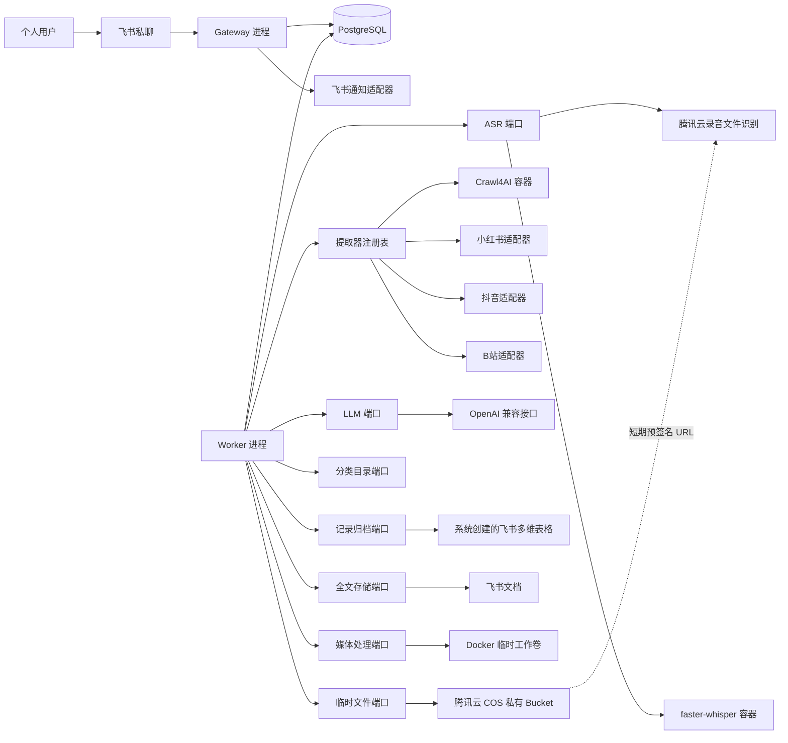
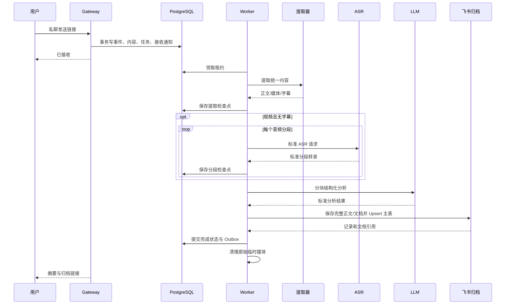

# 知归 KnowWhere 技术选型与系统架构设计

> 架构目标：外部能力可替换、长任务可恢复、失败不丢数据、首版不过度设计。

## 0. 文档信息

| 项目 | 内容 |
| --- | --- |
| 文档版本 | v1.2 |
| 文档状态 | 架构基线稿 |
| 创建日期 | 2026-08-27 |
| 关联需求 | [PRD v1.3](./PRD.md) |
| 架构形态 | 模块化单体 + 独立 Worker + 可选重型适配器容器 |
| 主要部署 | Docker Compose 应用容器 + 用户自建 PostgreSQL |

### 0.1 文档目标

本文档回答五个问题：

1. 为什么选择这些技术，而不是只列出技术名称。
2. 哪些部分是稳定业务核心，哪些部分是不稳定外部能力。
3. ASR、LLM、内容提取、飞书归档、任务后端等能力如何替换。
4. 不限时长视频、完整正文、失败恢复和幂等如何落地。
5. 开发时必须遵守哪些边界，才能避免“接口存在但实际上换不动”。

### 0.2 关键结论

1. 使用 **Python 3.12**：目标内容提取工具与 ASR 生态集中在 Python，且小红书、抖音候选适配器要求 Python 3.12 或更高。
2. 使用 **模块化单体**：单用户、低并发不需要微服务；Gateway 与 Worker 使用同一代码库和镜像，以不同命令运行。
3. 使用 **六边形架构（Ports and Adapters）**：领域与应用层不得依赖飞书 SDK、模型 SDK、ASR SDK、抓取工具、FastAPI 或数据库实现。
4. 使用 **PostgreSQL 作为内部事实源和持久任务后端**：飞书多维表格是用户可见归档投影，不承担任务恢复职责。
5. 首版 **不引入 Redis/Celery**：任务量低，PostgreSQL 租约队列已满足持久化、并发领取、重试和恢复；未来可替换为 Celery、Temporal 或云队列。
6. ASR、LLM、内容提取、消息入口、归档、全文存储、临时文件存储均定义独立端口。
7. 首版默认 ASR 为腾讯云录音文件识别；faster-whisper 作为可选本地容器保留，二者实现同一 ASR 操作契约。
8. 所有外部调用采用“至少一次执行 + 幂等写入”，不追求跨第三方系统无法实现的虚假“恰好一次”。
9. 飞书归档工作区由系统在首次绑定时创建并版本化管理，资源 ID 持久化在 PostgreSQL；运行时不依赖用户手工维护外部 ID。
10. 首版临时对象存储使用腾讯云 COS；本地卷只承担 FFmpeg 工作空间，跨阶段音频分段通过 `ArtifactStorePort` 写入私有 COS 并按状态机清理。

---

## 1. 第一性原理推导

### 1.1 不可改变的事实

| 事实 | 架构后果 |
| --- | --- |
| 用户只有一个 | 不需要多租户、服务发现、分布式权限系统和水平扩展优先设计 |
| 飞书消息必须快速确认 | 接入进程只能校验和落任务，不能同步抓取、转录或调用 LLM |
| 视频不限制时长 | 任务可能运行数小时，必须分段、检查点、续跑和资源背压 |
| 第三方平台经常变化 | 每个平台必须独立适配，不能让平台响应结构进入业务层 |
| LLM、ASR 厂商会更换 | 业务流程只依赖稳定输入输出契约，供应商差异停留在适配器内 |
| 完整正文必须保存 | 多维表格容量不足时必须有全文存储端口，不能只保存摘要或截断文本 |
| 多维表格由系统创建 | 首次绑定需要幂等资源初始化、Schema Migration、协作者授权和资源绑定恢复 |
| 原始音视频不保留 | 本地工作文件和 COS 临时对象都需要生命周期管理，转录持久化后立即清理 |
| 部署环境是 Docker | 浏览器、FFmpeg、ASR 模型和字体依赖必须在镜像或独立容器中可复现 |

### 1.2 核心矛盾

系统真正困难的部分不是调用 AI，而是：

1. 如何在平台抓取失败、容器重启、模型限流和飞书写入失败时不丢任务。
2. 如何让长视频处理中间任一步失败后从检查点继续，而不是重新下载和转录全部内容。
3. 如何保证切换 ASR 或 LLM 后，领域数据、状态机和归档流程不需要修改。

因此架构优先级为：

> 数据与任务可靠性 ＞ 边界清晰 ＞ 可测试性 ＞ 单机效率 ＞ 横向扩展能力。

### 1.3 “可替换”的真实定义

可替换不等于零成本。不同层次的替换成本定义如下：

| 等级 | 含义 | 目标范围 |
| --- | --- | --- |
| R0 | 只改配置，不改代码 | 同一协议下更换 LLM 地址、模型；切换已实现的 ASR 适配器 |
| R1 | 新增一个适配器并通过契约测试 | 新 ASR 厂商、新归档系统、新平台解析器 |
| R2 | 替换基础设施适配器和部署配置 | PostgreSQL 任务后端换 Temporal/Celery，文件卷换 S3 |
| R3 | 替换入口框架，但领域与用例不变 | FastAPI 换其他 ASGI/HTTP 框架，飞书换 Telegram |
| R4 | 重写运行时实现，但协议和数据契约保留 | Python 全量换成 Go/Java；无法承诺零成本 |

本项目要求所有外部供应商能力达到 R0 或 R1，基础设施达到 R2，入口框架达到 R3。

---

## 2. 架构原则

### 2.1 依赖方向

代码依赖只能由外向内：

```text
外部 SDK / 数据库 / HTTP / Docker
              ↓
          Adapters
              ↓
 Application Ports + Use Cases
              ↓
            Domain
```

禁止反向依赖：

- `domain` 不得导入 FastAPI、SQLAlchemy、飞书 SDK、OpenAI SDK、faster-whisper 或 Crawl4AI。
- `application` 不得使用供应商响应对象作为参数或返回值。
- `adapters` 负责把第三方字段、错误、限流和状态映射为内部契约。
- 供应商选择只出现在 Composition Root，不得在用例中散布 `if provider == ...`。

### 2.2 模块化单体，而非微服务

首版核心代码是一个部署单元，运行成两个进程：

- `gateway`：飞书长连接、健康检查、管理命令入口。
- `worker`：领取持久任务，执行抓取、转录、分析、归档和通知。

浏览器抓取和本地 ASR 因依赖重、资源模型不同，可以作为独立容器，但它们仍是外部适配器，不是拥有业务数据的微服务。

### 2.3 事实源与投影

- PostgreSQL 是任务、阶段状态、幂等键、重试和归档绑定关系的事实源。
- 飞书多维表格是用户可见的内容归档投影。
- 飞书文档是超长正文和完整转录的默认全文存储实现。
- 本地临时工作卷和 COS 临时对象是处理中间存储，不是事实源，终态后必须清理。

如果飞书暂时不可用，内部任务仍然完整；恢复后只重试归档阶段。

---

## 3. 总体架构



### 3.1 Docker 服务拓扑

| 服务 | 是否必需 | 职责 | 是否持有业务状态 |
| --- | --- | --- | --- |
| `gateway` | 是 | 飞书长连接、事件校验、任务创建、Outbox 通知、健康检查 | 否 |
| `worker` | 是 | 执行任务流水线和重试 | 否，状态写 PostgreSQL |
| 用户自建 PostgreSQL | 外部必需 | 任务、内容索引、阶段检查点、Outbox、适配器绑定；不由 Compose 管理 | 是 |
| `crawler` | 推荐 | Crawl4AI 浏览器抓取服务 | 否 |
| `asr-local` | 可选 profile | faster-whisper 本地 ASR | 否，模型可缓存到卷 |
| `xhs-adapter` | 可选 | 小红书工具封装为稳定内部协议 | 否 |
| `douyin-adapter` | 可选 | 抖音工具封装为稳定内部协议 | 否 |

`gateway` 与 `worker` 使用同一业务镜像，只改变启动命令。这样共享领域模型和用例，不复制业务逻辑。

### 3.2 Compose Profile

| Profile | 组合 | 使用场景 |
| --- | --- | --- |
| `core` | gateway、worker、crawler + 外部 PostgreSQL | 使用云 ASR 的最小部署 |
| `local-asr-cpu` | core + CPU faster-whisper | 无 GPU 的本地转录 |
| `local-asr-gpu` | core + GPU faster-whisper | NVIDIA GPU 本地转录 |
| `platform-tools` | core + xhs-adapter + douyin-adapter | 使用本地平台工具 |

Docker Compose 负责应用服务、网络和临时卷，PostgreSQL 通过 `KW_DATABASE_URL` 接入并由用户独立运维；相关能力见 [Docker Compose 官方文档](https://docs.docker.com/compose/)。

---

## 4. 领域与应用模块

### 4.1 Domain

领域层只包含稳定概念：

- `ContentItem`：统一内容实体。
- `SourceReference`：原始 URL、规范 URL、平台和平台内容 ID。
- `ExtractedContent`：提取后的标题、作者、正文、媒体元数据和完整度。
- `Transcript`：完整文本、分段、语言、时间范围和警告。
- `AnalysisResult`：分类、标签、摘要、关键观点和质量等级。
- `ProcessingTask`：任务状态、当前阶段、重试策略和配置快照。
- `ArchiveBinding`：内容 ID 与飞书记录、飞书文档的绑定。
- `ProviderError`：统一错误码、是否可重试、建议等待时间和安全错误信息。

领域对象不保存第三方 SDK 对象、HTTP Response、SQLAlchemy Model 或飞书字段对象。

### 4.2 Application Use Cases

| 用例 | 主要职责 |
| --- | --- |
| `SubmitLinks` | 校验个人用户、提取 URL、幂等创建任务、发送接收回执 |
| `ProcessContent` | 驱动解析、提取、转录、分析、全文保存和归档状态机 |
| `RetryTask` | 根据错误类型和检查点从失败阶段续跑 |
| `BootstrapArchiveWorkspace` | 绑定首次私聊用户，幂等创建归档工作区、Schema 和协作者权限 |
| `SyncCategories` | 从系统创建的多维表格读取默认与自定义分类 |
| `ReanalyzeContent` | 使用新的 LLM/提示词重新分析，不重新抓取已保存正文 |
| `CleanupArtifacts` | 清理终态任务原始媒体和过期中间文件 |
| `DispatchOutbox` | 幂等发送飞书终态通知和运维通知 |

### 4.3 Adapters

适配器分为三类：

1. **Inbound**：飞书长连接、管理 CLI、健康检查 HTTP。
2. **Outbound**：LLM、ASR、平台提取、飞书表格、飞书文档、临时存储。
3. **Infrastructure**：PostgreSQL Repository、任务租约、Outbox、配置和日志。

---

## 5. 可替换端口清单

| 端口 | 稳定输入 | 稳定输出 | 默认适配器 | 可替代实现 | 目标替换等级 |
| --- | --- | --- | --- | --- | --- |
| `MessageGatewayPort` | 规范消息、用户标识 | 接收事件、发送消息结果 | 飞书长连接 | 飞书 Webhook、Telegram、微信 | R1/R3 |
| `ContentExtractorPort` | URL、认证配置引用 | `ExtractedContent` | 平台适配器 + Crawl4AI | Firecrawl、自建 Playwright、云解析 API | R1 |
| `MediaProcessorPort` | 媒体引用、目标格式 | 规范音频、分段清单 | FFmpeg | GStreamer、云媒体处理 | R1 |
| `AsrProviderPort` | 音频分段、语言和时间戳要求 | 标准 ASR 操作引用、状态和转录结果 | 腾讯云录音文件识别 | faster-whisper、OpenAI 兼容 ASR、阿里云、火山等 | R0/R1 |
| `LlmProviderPort` | 消息、JSON Schema、模型能力要求 | 结构化 JSON | OpenAI 兼容适配器 | LiteLLM、Ollama、厂商 SDK | R0/R1 |
| `CategoryCatalogPort` | 字段映射 | 当前分类集合与版本 | 飞书多维表格字段选项 | YAML、数据库、Notion | R1 |
| `RecordArchivePort` | 统一归档记录、可选内联全文 | 外部记录引用 | 飞书多维表格 | Notion、Airtable、Karakeep、PostgreSQL UI | R1 |
| `ArchiveWorkspacePort` | 工作区蓝图、所有者标识、Schema 版本 | 工作区、表、字段和视图绑定 | 飞书多维表格初始化器 | Notion Database、Airtable Base、预置资源适配器 | R1 |
| `FullTextStorePort` | 完整 Markdown、内容 ID | 全文引用 | 飞书文档 | 本地 Markdown、S3/MinIO、Notion Page | R1 |
| `ArtifactStorePort` | 临时二进制或文本流、生命周期和 URL 能力要求 | `ArtifactRef`、短期读取引用、删除结果 | 腾讯云 COS | Docker 本地卷、S3、MinIO、NAS | R1/R2 |
| `TaskBackendPort` | 任务和阶段租约 | 可恢复任务流 | PostgreSQL 租约队列 | Celery/Redis、Temporal、云队列 | R2 |
| `TaskRepositoryPort` | 领域任务对象 | 持久化任务对象 | SQLAlchemy/PostgreSQL | 其他 ORM、MySQL、SQLite | R2 |
| `ClockPort` | 无 | 当前时间 | 系统时钟 | 测试时钟 | R0 |
| `IdGeneratorPort` | 业务前缀 | 唯一 ID | UUIDv7/ULID | 数据库序列、雪花算法 | R0/R1 |

### 5.1 端口设计硬规则

1. 端口参数和返回值只能使用项目内部模型。
2. 所有端口都必须有 Fake 实现和契约测试套件。
3. 适配器错误必须映射成 `ProviderError`，业务层不得判断供应商异常类。
4. 每个适配器必须公开 `provider_id`、版本和能力描述。
5. 供应商高级功能通过能力协商启用，不得扩大稳定端口的必填字段。
6. 配置切换只发生在 Composition Root，新任务保存实际使用的适配器与模型快照。
7. 常规自动重试使用原配置快照；人工“重新处理”可以选择当前新配置。

### 5.2 临时对象存储契约

`ArtifactStorePort` 不暴露 COS Bucket、SDK 响应或厂商异常，稳定能力为：

1. `put(stream, metadata, retention)`：流式写入并返回 `ArtifactRef`，不得要求业务层先把完整文件读入内存。
2. `open(artifact_ref)`：供本地媒体处理或替代 ASR 读取。
3. `presign_get(artifact_ref, expires_at)`：能力可选；返回仅对指定对象和短时间有效的 HTTPS 读取引用。
4. `delete(artifact_ref)`：幂等删除；对象已不存在也视为成功。
5. `head(artifact_ref)`：读取大小、哈希、内容类型和存在性，用于上传完整性与清理核对。

腾讯云实现使用私有 Bucket 和固定 `knowwhere-temp/` 前缀。对象键由内部任务 ID、分段 ID 和随机量生成，不含标题、作者、用户 ID 或原平台账号。共享 Bucket 的全局生命周期配置不由应用擅自覆盖；应用删除是主清理路径，前缀级生命周期规则仅作为用户显式配置的兜底。

---

## 6. ASR 架构

### 6.1 职责拆分

ASR 供应商不负责长视频业务流程。核心 `TranscriptionOrchestrator` 负责：

1. 获取媒体并校验格式。
2. 通过 `MediaProcessorPort` 规范化为统一音频格式。
3. 根据 ASR 能力和资源水位生成分段清单。
4. 逐段调用 `AsrProviderPort`。
5. 为每段写入检查点。
6. 处理相邻分段重叠文本并按时间顺序合并。
7. 持久化完整转录后清理原始媒体。

因此切换 ASR 不会改变下载、分段、续跑、合并和归档逻辑。

### 6.2 ASR 输入契约

| 字段 | 类型 | 必填 | 说明 |
| --- | --- | --- | --- |
| `request_id` | string | 是 | 幂等和日志关联 ID |
| `audio_ref` | ArtifactRef | 是 | 供应商适配器可读取的音频引用 |
| `audio_sha256` | string | 是 | 缓存、完整性和幂等依据 |
| `format` | string | 是 | 规范格式，如 FLAC/WAV |
| `start_ms` | integer | 是 | 当前分段在原视频中的开始时间 |
| `duration_ms` | integer | 是 | 当前分段时长 |
| `language_hint` | string/null | 否 | 语言提示，不强制供应商接受 |
| `timestamps` | enum | 是 | `none`、`segment`、`word` |
| `context_hint` | string/null | 否 | 上一段尾部短文本，用于连续性，不含业务指令 |

### 6.3 ASR 操作与输出契约

云 ASR 可能异步完成，稳定端口不得假设“一次 HTTP 响应直接返回全文”。统一操作契约为：

1. `start(request)` 返回 `AsrOperationRef`；本地同步实现也返回一个立即完成的操作引用。
2. `poll(operation_ref)` 返回 `pending`、`completed` 或 `failed`，完成时携带标准转录结果。
3. 远端任务 ID、提交时间和供应商配置快照在首次响应后立即写入阶段检查点。
4. 供应商不支持幂等提交且提交结果不确定时，不盲目重复提交；进入 `ASR_SUBMIT_UNCERTAIN`，经超时确认或人工重试后再产生新任务。

`AsrOperationRef` 至少包含：

| 字段 | 类型 | 说明 |
| --- | --- | --- |
| `provider_id` | string | 实际适配器 |
| `operation_id` | string | 内部稳定操作 ID，不直接使用供应商任务 ID充当业务唯一键 |
| `provider_task_ref` | string/null | 供应商任务引用，仅由对应适配器解释 |
| `status` | enum | `pending`、`completed`、`failed` |
| `submitted_at` | datetime | 提交时间，用于超时和有效期判断 |

完成后的标准转录结果为：

| 字段 | 类型 | 说明 |
| --- | --- | --- |
| `provider_id` | string | 实际适配器 |
| `model` | string | 实际模型 |
| `language` | string/null | 检测语言 |
| `segments` | list | 按时间升序的文本分段 |
| `segments[].start_ms` | integer | 相对于完整媒体的绝对时间 |
| `segments[].end_ms` | integer | 相对于完整媒体的绝对时间 |
| `segments[].text` | string | 分段文本 |
| `segments[].confidence` | number/null | 供应商提供时映射，否则为空 |
| `full_text` | string | 当前音频分段完整文本 |
| `warnings` | list | 静音、低置信度、语言异常等 |

### 6.4 ASR 能力描述

每个 ASR 适配器声明：

- 最大单请求文件大小。
- 建议单段时长，而不是产品最大视频时长。
- 支持的音频格式。
- 是否支持分段或单词时间戳。
- 是否支持语言自动识别和语言提示。
- 是否支持幂等键、异步任务和回调。
- 本地、云端及数据出境属性。

核心根据能力选择分段大小，不根据供应商名称写分支。

### 6.5 默认与替代实现

- 首版默认实现：`tencent_cloud_recognition` 适配器调用腾讯云 `CreateRecTask`，并通过 `DescribeTaskStatus` 轮询结果。接口是异步任务，结果在腾讯云侧只保留 24 小时，因此完成后必须立即规范化并持久化。
- 首版提交方式：使用 `ArtifactStorePort` 把音频分段写入私有腾讯云 COS，生成短期预签名 HTTPS URL，并以 `SourceType=0` 提交。腾讯云文档当前限制单个 URL 音频不超过 5 小时、文件不超过 1GB；这是单次供应商请求限制，不是知归的视频总时长限制。
- 小文件兼容路径：当对象存储不可用且分段编码后不超过 5MB 时，腾讯云适配器可以声明支持 `SourceType=1` Base64 直传；该路径是适配器内降级，不改变业务状态机。
- 清理时序：ASR 取得并持久化该分段结果后删除对应 COS 对象；任务进入不可重试终态时也执行清理。删除失败写入独立清理任务，不阻塞已保存的转录但不得静默忽略。
- 本地替代实现：独立 `asr-local` 容器运行 [faster-whisper](https://github.com/SYSTRAN/faster-whisper)，支持 CPU/GPU 配置；其项目声明支持 Python 3.9+、CPU/GPU 和时间戳等能力。
- 其他云实现：每个厂商使用独立适配器，或实现 OpenAI 风格音频转录协议的通用适配器。
- 配置切换：`KW_ASR_PROVIDER` 选择已经注册的适配器；切换不修改用例代码。
- 模型缓存：本地模型卷与业务临时卷分离，清理媒体时不删除模型。

### 6.6 ASR 契约测试

每个实现必须通过同一组测试：

1. 输入 10 秒中文音频能返回非空文本。
2. 分段时间戳单调递增且不超出音频范围。
3. `full_text` 与分段拼接在归一化后等价。
4. 重复相同请求不会产生不可控副作用。
5. 无效音频、鉴权失败、限流、超时映射为统一错误码。
6. 供应商不支持时间戳时通过能力描述明确降级。
7. 长音频分成多段后可以从中间检查点恢复并生成完整结果。

---

## 7. LLM 架构

### 7.1 核心契约

`LlmProviderPort` 只负责一次结构化生成，不负责业务分类流程。输入包括：

- 系统规则和不可信内容边界。
- 当前内容片段或分段摘要。
- 当前允许分类集合。
- 输出 JSON Schema。
- 提示词版本、温度、最大输出和幂等追踪信息。

输出是通过内部 Schema 校验后的结构化对象或统一错误。

### 7.2 OpenAI 兼容适配器

默认适配器使用可配置的 `base_url`、`api_key` 和 `model`。官方 Python SDK支持自定义 `base_url`；OpenAI 官方文档也说明 Structured Outputs 可让响应遵循 JSON Schema，并提供 Python/Pydantic 的结构化解析方式：[OpenAI SDK 文档](https://developers.openai.com/api/docs/libraries)、[Structured Outputs](https://developers.openai.com/api/docs/guides/structured-outputs)。

但“OpenAI 兼容”供应商不一定完整实现同一端点和 Structured Outputs，因此适配器必须声明：

- 使用 Responses API 还是 Chat Completions 风格端点。
- 是否真正支持 JSON Schema。
- 上下文窗口和单次最大输入。
- 是否支持流式、Seed、缓存或用量统计。

若不支持 JSON Schema，适配器降级为严格 JSON 提示，返回后仍由 Pydantic 校验；不能跳过内部校验。

### 7.3 长正文分析

长正文处理由 `AnalysisOrchestrator` 负责：

1. 按标题和段落边界切块，避免任意字符截断。
2. 每块生成忠实的局部事实摘要和主题候选。
3. 保存每块结果检查点。
4. 汇总全部局部结果，最终生成唯一一级分类、标签、摘要和关键观点。
5. 将提示词版本、分类版本、模型和内容哈希写入结果快照。

模型切换后可以读取已保存完整正文重新分析，不必再次访问原平台。

### 7.4 LLM 契约测试

1. 输出必须通过统一 JSON Schema。
2. 分类必须来自传入集合，不能生成新分类。
3. 输入包含提示词注入文本时，输出结构和权限不改变。
4. 内容不足时返回 `partial` 或 `metadata_only`，不能扩写事实。
5. 超长输入必须走分块流程且所有分块都有检查点。
6. 限流、上下文超限、内容拒绝和鉴权失败映射为统一错误码。

---

## 8. 内容提取架构

### 8.1 提取器注册表

每个提取器实现：

- `supports(url, platform)`：仅做轻量判定。
- `extract(request)`：返回统一 `ExtractedContent`。
- `capabilities()`：声明支持正文、图片、视频、字幕和登录态。
- `health()`：检查依赖服务和认证状态。

注册表根据平台配置和优先级选择适配器；失败时按可配置策略使用下一个适配器，而不是硬编码回退链。

### 8.2 默认策略

| 平台 | 默认策略 | 备用策略 |
| --- | --- | --- |
| 微信公众号 | 专用 DOM 规则 + 浏览器提取 | 通用 Crawl4AI |
| 稀土掘金 | 公开页面/API 适配器 | 通用 Crawl4AI |
| 小红书 | 分享短链 + 公开页面初始状态适配器 | 云解析 API 或受控浏览器适配器 |
| 抖音 | 独立适配器服务 | 云解析 API 或受控浏览器适配器 |
| B站 | 公开元数据与 DASH 音频适配器 | 外部工具适配器或受控浏览器 |
| 其他网页 | Crawl4AI HTTP 适配器 | 自建 Playwright/Readability |

[Crawl4AI](https://github.com/unclecode/crawl4ai) 提供异步浏览器、动态页面和 Markdown 输出，并有 Docker 服务形态，适合放在独立适配器容器中，而不是把其对象暴露到应用层。

B站当前只把视频语音作为总结事实输入：适配器通过公开详情接口取得 BV/CID/分P元数据，再从 DASH 音轨中选择最高带宽的匿名可访问轨道；流式 GET 失败时依次回退同轨 `backupUrl`。CDN 不保证正确响应 HEAD 请求，因此健康判断不能用 HEAD 替代真实 GET。音频 URL 具有时效性，只能用于当前提取调用，不进入检查点或持久化结果。

小红书当前使用匿名公开页面路线：逐跳校验 `xhslink.cn`/`xhslink.com` 到官方详情页，从 `window.__INITIAL_STATE__` 的目标 `noteDetailMap` 读取字段。图文下载全部有序图片并复用视觉端口；视频选择最高分辨率流并复用 FFmpeg、COS 和 ASR 端口。页面访问令牌与 CDN 地址均为短期事实，只在单次调用内存中存在。

### 8.3 平台工具许可证边界

- XHS-Downloader 与 TikTokDownloader 当前均为 GPL-3.0 候选项目，MediaCrawler 使用非商业学习许可证。
- 不把这些候选项目直接链接或复制进核心 Python 包；小红书当前实现只参考公开协议事实并独立实现。
- 若使用，以独立适配器服务或用户自行安装的外部工具接入，但进程隔离不是规避许可证义务的手段。
- 发布镜像或组合发行前必须做许可证兼容性审查。
- 任何无明确许可证项目都不得复制代码进入仓库。

### 8.4 统一提取结果

`ExtractedContent` 至少包含：

- 来源、平台内容 ID 和规范 URL。
- 标题、作者、发布时间和内容类型。
- 完整正文或简介。
- 媒体、字幕、封面引用。
- 提取完整度和依据。
- 登录态要求、警告和可重试错误。
- 提取器 ID、版本和原始响应哈希。

原始供应商 JSON 只允许作为受限调试附件，不进入领域对象和飞书字段。

### 8.5 全文归档编排

全文保存由应用层 `ArchiveOrchestrator` 决策，不由 LLM、提取器或单一飞书适配器决定：

1. 根据系统创建的多维表格字段能力计算完整文本是否可以内联。
2. 可以内联时，通过 `RecordArchivePort` 把完整正文与结构化元数据一起 Upsert 到既有记录。
3. 不可内联时，先通过 `FullTextStorePort` 创建或更新飞书文档，再把预览和 `FullTextRef` Upsert 到多维表格。
4. `FullTextRef` 明确记录 `record_field` 或 `external_document`、供应商、外部 ID、内容哈希和版本。
5. 重新分析时，`ArchivedContentReader` 根据 `FullTextRef` 从 `RecordArchivePort` 或 `FullTextStorePort` 读取完整文本。

这样既满足短内容直接保存在表格、长内容保存在飞书文档的产品要求，又避免把“全文一定在飞书文档”写死在业务流程中。

### 8.6 飞书归档工作区初始化

归档资源初始化是独立用例，不混入内容写入适配器：

1. 飞书开发者后台把应用可用范围限制为该个人用户；系统收到第一条私聊事件后，以事件中的 `open_id` 绑定唯一所有者。
2. `ArchiveWorkspacePort.ensure_workspace()` 使用稳定工作区键和目标 Schema 版本执行幂等初始化。
3. 首次创建“知归”多维表格，复用接口返回的默认数据表，再创建或更新系统字段、选项和默认视图。
4. 通过云文档协作者接口把绑定用户设置为 `full_access`；多维表格和后续全文文档均执行同样授权。
5. 把 `app_token`、`table_id`、字段 ID、视图 ID、所有者 `open_id` 和 Schema 版本写入 `archive_workspaces`。
6. 重启时先读取绑定并向飞书校验；只补齐缺失的系统资源，不删除用户自建视图、用户分类或内容记录。
7. 数据库绑定丢失时，不按名称直接新建第二套资源；进入可恢复故障并要求执行受控的重新发现或重新绑定流程。

工作区创建和内容 Upsert 使用不同端口，可以在将来切换到 Notion、Airtable 或预置资源模式时保持内容处理用例不变。

---

## 9. 任务可靠性设计

### 9.1 为什么使用 PostgreSQL 持久任务

任务量低，但单任务很长。系统更需要“可恢复”而不是“每秒处理成千上万条”。PostgreSQL 同时保存业务状态和任务租约，可以：

- 在创建任务的同一事务内保存幂等事件和任务。
- 使用行锁领取任务，避免两个 Worker 同时处理。
- 通过租约和心跳回收崩溃任务。
- 不引入 Redis 与数据库之间的双写一致性问题。

PostgreSQL 官方 `SELECT` 支持 `FOR UPDATE ... SKIP LOCKED`，可用于并发 Worker 跳过已被领取的任务：[PostgreSQL SELECT 文档](https://www.postgresql.org/docs/current/sql-select.html)。

### 9.2 执行语义

- 语义：至少一次执行。
- 保证方式：阶段幂等、外部 Upsert、事件去重和结果检查点。
- 不承诺：跨 PostgreSQL、飞书、云模型的全局恰好一次事务。

### 9.3 任务租约

任务后端需要实现：

- 原子领取一个到期任务。
- `locked_by`、`locked_until` 和心跳。
- Worker 崩溃后租约到期自动回收。
- 按阶段、优先级和下一次重试时间筛选。
- 指数退避、供应商 `retry_after` 和最大尝试次数。
- 人工重试从最近成功检查点继续。

### 9.4 Outbox

任务状态更新和“待发送飞书通知”在同一数据库事务中提交。独立 Outbox Dispatcher 负责发送并记录结果，避免：

- 数据库已完成但飞书未通知。
- 飞书已通知但数据库回滚。
- 容器重启后重复发送不可控消息。

Gateway 在提交“已接收”Outbox 后立即唤醒 Dispatcher，以满足 3 秒回执目标；定时扫描仍作为崩溃和网络异常后的可靠兜底。

### 9.5 阶段检查点

| 阶段 | 主要持久结果 | 重试时是否复用 |
| --- | --- | --- |
| URL 解析 | 规范 URL、平台 ID | 是 |
| 内容提取 | 标准正文、媒体清单、提取器版本 | 是 |
| 媒体规范化 | 音频清单、哈希、时长 | 是 |
| ASR 分段 | 每段转录和时间范围 | 是 |
| 完整转录 | 合并文本和校验哈希 | 是 |
| LLM 分块 | 每块结构化结果 | 是 |
| LLM 汇总 | 最终分析、模型与提示词版本 | 是 |
| 全文保存 | 飞书文档或表格字段引用 | 是 |
| 表格归档 | 飞书记录 ID 和版本 | 是 |
| 通知 | 消息 ID | 是 |

---

## 10. 数据模型

### 10.1 内部表

| 表 | 作用 | 关键约束 |
| --- | --- | --- |
| `inbound_events` | 飞书消息投递去重与事件追踪 | `source + message_id` 唯一，`event_id` 保留用于追踪 |
| `content_items` | 内容身份与最新状态 | `platform + platform_content_id` 或规范 URL 唯一 |
| `processing_tasks` | 当前任务和租约 | 任务状态、阶段、锁和配置快照 |
| `stage_runs` | 每阶段尝试与检查点 | `task_id + stage + attempt` 唯一 |
| `artifacts` | 临时或中间文件引用 | 类型、哈希、生命周期和存储适配器 |
| `archive_bindings` | 内部内容与飞书记录/文档绑定 | `content_id + archive_provider` 唯一 |
| `archive_workspaces` | 归档工作区、所有者、表/字段/视图绑定与 Schema 版本 | `provider + workspace_key` 唯一 |
| `category_snapshots` | 系统表格分类集合缓存 | 来源版本和同步时间 |
| `outbox_events` | 可靠外部通知 | 幂等键、状态和下次发送时间 |

### 10.2 大文本与二进制

- PostgreSQL 不长期保存原始音视频。
- 处理中的媒体和音频分段保存在 `ArtifactStorePort`，数据库只保存引用和哈希。
- 完整正文与转录成功写入飞书表格或飞书文档后，中间文本可按保留策略清理。
- 重新分析时由 `ArchivedContentReader` 根据 `FullTextRef` 从表格字段或全文存储读取正文，而不是重新抓取原平台。

### 10.3 幂等键

| 场景 | 幂等键 |
| --- | --- |
| 飞书消息投递 | `feishu:message_id` |
| 内容实体 | `platform:platform_content_id`，缺失时使用规范 URL 哈希 |
| ASR 分段 | `audio_sha256:start_ms:end_ms:provider_profile_hash` |
| LLM 分块 | `content_hash:chunk_hash:prompt_version:model_profile_hash` |
| 飞书全文 | `content_id:fulltext_version` |
| 飞书记录 | `content_id` |
| 终态通知 | `task_id:terminal_status` |

---

## 11. 端到端时序



### 11.1 关键事务边界

1. 接收事件事务只写内部数据库，不调用抓取、模型和飞书归档。
2. 每个阶段完成后先保存检查点，再进入下一阶段。
3. 外部调用不放在长数据库事务中。
4. 飞书文档与表格不能组成原子事务，使用幂等 Upsert 和 `archive_bindings` 恢复。
5. 只有全文已持久化、主表已 Upsert 后才允许标记 `completed`。

---

## 12. 技术选型

### 12.1 核心技术

| 层面 | 选择 | 选择理由 | 替代方案与边界 |
| --- | --- | --- | --- |
| 语言 | Python 3.12 | 抓取、ASR、AI 生态一致；XHS/TikTok 候选项目要求 3.12+ | 3.13 需回归依赖；Go/Java 属 R4，保留协议与数据模型 |
| 包管理 | uv + `pyproject.toml` + lockfile | 安装和锁定快；项目元数据使用标准格式 | pip-tools、Poetry、PDM；业务代码不依赖 uv |
| API/健康检查 | FastAPI | 基于 Python 类型提示，适合边界 DTO 和 OpenAPI；[官方文档](https://fastapi.tiangolo.com/) | Starlette、Litestar、Flask；仅替换 entrypoint |
| 边界校验 | Pydantic v2 | 类型驱动的验证和序列化；[官方文档](https://docs.pydantic.dev/latest/) | msgspec、dataclasses + jsonschema；领域对象不依赖 Pydantic |
| HTTP 客户端 | HTTPX | 异步、超时和连接池能力，适合适配器 | aiohttp、供应商 SDK 内置客户端；封装在适配器 |
| 数据库 | PostgreSQL 15+ | 事务、JSONB、行锁、可靠并发领取任务；由用户独立部署和备份 | MySQL 或 SQLite 需重写 Repository/TaskBackend 适配器 |
| ORM | SQLAlchemy 2.x | Repository 中成熟的映射和事务支持 | psycopg SQL、SQLModel、其他 ORM；不进入领域层 |
| 数据迁移 | Alembic | 与 SQLAlchemy 配套、迁移可审计 | 原生 SQL 迁移、Flyway；仅基础设施层 |
| 任务后端 | PostgreSQL 租约队列 | 单事实源、无 Redis 双写、适合个人低并发和长任务 | Celery/Redis、Dramatiq、Temporal、云队列，实现 `TaskBackendPort` |
| 飞书接入 | 官方 `lark-oapi` Python SDK 长连接 | 官方 SDK 封装 token、签名、事件和模型；[官方仓库](https://github.com/larksuite/oapi-sdk-python) | Webhook 或直接 HTTP API，替换 `MessageGatewayPort` |
| 云 ASR | 腾讯云录音文件识别 + 官方 Python SDK | 与长音频异步任务匹配；支持直接音频数据或 URL；供应商限制通过能力描述隔离 | faster-whisper、OpenAI 兼容 ASR、其他云厂商，实现 `AsrProviderPort` |
| 通用网页抓取 | Crawl4AI 独立容器 | 动态浏览器、Markdown、Docker API；Apache-2.0 | Firecrawl、自建 Playwright、云解析 API |
| 媒体处理 | FFmpeg CLI 适配器 | 格式覆盖广，适合音频规范化和切片 | GStreamer、PyAV、云媒体处理 |
| 本地 ASR | faster-whisper 独立容器 | MIT，支持 CPU/GPU、量化和时间戳 | whisper.cpp、云 ASR、其他本地模型 |
| LLM | `openai-python` 封装的 OpenAI 兼容适配器 | 自定义 base URL、类型定义完整 | 直接 HTTPX、LiteLLM、Ollama、厂商 SDK |
| 配置 | pydantic-settings + 环境变量/挂载文件 | 类型校验，适合 Docker | Dynaconf、纯环境变量；只替换配置加载器 |
| 日志 | 标准 logging + JSON Formatter | 依赖少，stdout 适合容器 | structlog、loguru；统一日志字段不变 |
| 指标 | Prometheus client | 单机部署简单、可抓取 | OpenTelemetry Metrics、云监控 |
| 追踪 | OpenTelemetry API，MVP 可关闭导出 | 保留厂商中立 Trace 接口 | 仅日志关联 ID、厂商 APM |
| 测试 | pytest | 单元、参数化和 fixture 生态成熟 | unittest；契约测试数据与规则不变 |
| 代码质量 | Ruff + mypy | 快速 lint/format 和静态类型检查 | Black/Flake8/Pyright；不影响运行时 |

### 12.2 为什么是 Python 3.12

候选依赖的官方项目配置显示：Crawl4AI 要求 Python 3.10+、faster-whisper 要求 3.9+，XHS-Downloader 与 TikTokDownloader 要求 3.12+。选择 3.12 能覆盖共同交集，同时比直接追逐最新解释器更稳。

### 12.3 为什么不把 Dify/n8n 放进核心

- 任务状态、检查点、幂等和全文保存是本项目核心资产，不应由外部工作流产品的数据模型决定。
- 低代码节点容易把供应商字段直接串联，切换成本反而更高。
- Dify/n8n 可以作为未来 `LlmProviderPort` 或 `TaskBackendPort` 的适配器，但不是领域流程的拥有者。

### 12.4 为什么不首选 Celery/Redis

- 需要 PostgreSQL 保存业务状态，Celery/Redis 会新增第二套任务事实。
- 创建数据库任务和发布 Broker 消息存在双写窗口，需要额外 Outbox 或补偿。
- 单用户并发不需要 Redis 的吞吐优势。
- 当未来出现多机高并发、复杂定时或工作流可视化需求时，再按 `TaskBackendPort` 替换。

---

## 13. 目录结构建议

```text
src/knowwhere/
├── domain/
│   ├── entities/
│   ├── value_objects/
│   ├── errors/
│   └── policies/
├── application/
│   ├── ports/
│   │   ├── inbound/
│   │   └── outbound/
│   ├── use_cases/
│   ├── services/
│   └── dto/
├── adapters/
│   ├── inbound/
│   │   ├── feishu_ws/
│   │   ├── health_http/
│   │   └── cli/
│   └── outbound/
│       ├── extractors/
│       ├── asr/
│       ├── llm/
│       ├── feishu_bitable/
│       ├── feishu_docs/
│       └── artifact_store/
├── infrastructure/
│   ├── database/
│   ├── task_backend/
│   ├── outbox/
│   ├── config/
│   └── observability/
├── bootstrap/
│   ├── registry/
│   └── composition_root.py
└── entrypoints/
    ├── gateway.py
    ├── worker.py
    └── cli.py

services/
├── asr_faster_whisper/
├── xhs_adapter/
└── douyin_adapter/

tests/
├── unit/
├── contract/
├── integration/
├── e2e/
├── fixtures/
└── golden/

docs/
├── PRD.md
├── TECHNICAL_ARCHITECTURE.md
└── adr/
```

### 13.1 代码约束

- 每个方法和变量前添加简要中文注释，遵循仓库 AGENTS.md 约束。
- 领域层优先使用标准库不可变数据类或值对象。
- Pydantic 只用于配置、API/适配器 DTO 和结构化输出校验。
- SQLAlchemy Model 只存在于 `infrastructure/database`。
- 外部 SDK 只存在于对应适配器目录。
- Composition Root 是唯一允许选择具体实现的位置。

---

## 14. 配置与适配器注册

### 14.1 核心配置

| 配置 | 示例 | 说明 |
| --- | --- | --- |
| `KW_DATABASE_URL` | PostgreSQL DSN | 内部事实源连接地址 |
| `KW_MESSAGE_GATEWAY` | `feishu_ws` | 消息入口适配器 |
| `KW_TASK_BACKEND` | `postgres` | 持久任务后端 |
| `KW_FEISHU_APP_ID` | `cli_...` | 飞书自建应用标识 |
| `KW_FEISHU_APP_SECRET` | 密钥 | 飞书应用身份凭据，不得进入日志或任务快照 |
| `KW_LLM_API_KEY` | 密钥 | OpenAI 兼容接口凭据 |
| `KW_LLM_BASE_URL` | 供应商地址 | OpenAI 兼容根地址 |
| `KW_LLM_MODEL` | 模型标识 | 不在代码中写死 |
| `KW_LLM_TIMEOUT_SECONDS` | `180` | 单次生成读取超时 |
| `KW_LLM_THINKING_MODE` | 空 | 可选非标准扩展，不支持时不发送 |
| `KW_ASR_PROVIDER` | `tencent_cloud_recognition` | ASR 适配器 |
| `KW_TENCENTCLOUD_APP_ID` | 腾讯云 AppId | 账号与 Bucket 核对 |
| `KW_TENCENTCLOUD_SECRET_ID` | 密钥 | ASR/COS 首版共享的最小权限凭据 |
| `KW_TENCENTCLOUD_SECRET_KEY` | 密钥 | 与 SecretId 配对，不得进入日志 |
| `KW_TENCENT_ASR_ENGINE_MODEL_TYPE` | `16k_zh` | 腾讯云引擎类型，可配置且不写死在适配器 |
| `KW_ARCHIVE_WORKSPACE` | `feishu_managed` | 归档工作区初始化适配器 |
| `KW_ARCHIVE_BOOTSTRAP_MODE` | `first_private_message` | 由首个可用范围内私聊用户完成个人绑定 |
| `KW_EXTRACTOR_WECHAT` | `wechat_browser` | 微信公众号提取器 |
| `KW_EXTRACTOR_JUEJIN` | `juejin_web` | 掘金提取器 |
| `KW_XIAOHONGSHU_REQUEST_TIMEOUT_SECONDS` | `60` | 小红书页面与媒体请求超时 |
| `KW_XIAOHONGSHU_MAX_IMAGE_BYTES` | `20971520` | 单张小红书图片大小上限 |
| `KW_XIAOHONGSHU_MAX_VIDEO_BYTES` | `4294967296` | 单个小红书视频大小上限 |
| `KW_XIAOHONGSHU_MAX_IMAGES` | `30` | 单篇小红书图文图片数量上限 |
| `KW_EXTRACTOR_DOUYIN` | `douyin_service` | 抖音提取器 |
| `KW_EXTRACTOR_GENERIC` | `crawl4ai_http` | 通用网页提取器 |
| `KW_RECORD_ARCHIVE` | `feishu_bitable` | 元数据归档适配器 |
| `KW_FULLTEXT_STORE` | `feishu_docs` | 全文存储适配器 |
| `KW_ARTIFACT_STORE` | `tencent_cos` | 跨阶段临时对象存储适配器 |
| `KW_COS_REGION` | `ap-shanghai` | COS Bucket 地域，必须与实际 Bucket 一致 |
| `KW_COS_BUCKET` | `knowwhere-temp-<appid>` | 完整 Bucket 名称，必须显式配置，禁止按“账号第一个 Bucket”隐式选择 |
| `KW_COS_PREFIX` | `knowwhere-temp/` | 知归专用对象前缀 |
| `KW_COS_PRESIGNED_URL_TTL_SECONDS` | `3600` | ASR 下载 URL 初始有效期；适配器可按任务状态安全续签 |

首版配置使用根目录 `.env`，仓库只提交 `.env.example`；进程环境变量可以覆盖文件值，生产环境应优先使用 Docker Secret 或外部密钥服务。LLM 固定走 OpenAI 兼容端口，只保留一组通用 `KW_LLM_*` 变量，不以厂商名建立嵌套配置。首版腾讯云 ASR 与 COS 复用 `SecretId`、`SecretKey`。配置加载后生成不可变快照并写入任务，但快照只保存密钥引用或版本，绝不复制密钥明文。生产化时优先改用仅含所需 ASR 与指定 COS 前缀权限的 CAM 子账号密钥。

### 14.2 注册规则

- 注册表由明确映射构建，不在运行时扫描任意 Python 包。
- 未知适配器名称启动失败，不能静默回退。
- 启动时执行适配器配置校验；外部服务不可用时可进入降级健康状态，但必须可见。
- 任务执行时使用任务快照中的适配器 ID；部署配置变更只影响新任务。

---

## 15. 错误、重试与熔断

### 15.1 统一错误分类

| 类别 | 示例 | 默认策略 |
| --- | --- | --- |
| 输入错误 | URL 无效、音频损坏 | 不重试 |
| 权限错误 | 飞书用户不匹配、内容私密 | 不自动重试 |
| 认证错误 | 平台 Cookie、云 API Key 失效 | 暂停对应适配器并告警 |
| 限流 | LLM/ASR/飞书 429 | 使用 `retry_after` 或退避 |
| 暂时错误 | 超时、服务 5xx、网络断开 | 有界重试 |
| 资源错误 | 磁盘水位、GPU OOM | 释放资源、降低并发后重试 |
| 契约错误 | 供应商返回字段变化 | 停用适配器、保存安全诊断信息 |
| 内容不足 | 空正文、仅元数据 | 按 PRD 降级或部分成功 |

### 15.2 重试边界

- 重试以阶段为单位，不重跑已成功阶段。
- 认证失败不进行高频自动重试。
- LLM 结构修复与网络重试分别计数。
- 飞书归档失败不重新抓取、转录或调用 LLM。
- 长视频单段失败只重试该段。
- 达到终态后清理原始媒体；存在计划重试时任务仍非终态，不提前清理依赖文件。

---

## 16. 安全设计

### 16.1 入口安全

- 飞书应用可用范围必须限制为个人用户；首个合法私聊发送者绑定为唯一用户，后续只接受该 `open_id`。
- 群聊事件直接拒绝，不创建任务。
- 飞书 `message_id` 用于重复投递幂等，`event_id` 只用于链路追踪；富文本只提取 URL，不执行内容中的命令。

### 16.2 抓取安全

- URL 在每次跳转前后校验协议、解析 IP 和目标端口。
- 拒绝 loopback、私网、链路本地、云元数据和 Docker 内部服务地址。
- 抓取容器使用独立网络和最小权限，不挂载 Docker Socket。
- 限制单响应大小、重定向次数、下载速率和临时磁盘水位；这些限制用于资源保护，不以视频时长为拒绝条件。

### 16.3 模型安全

- 抓取正文始终作为不可信数据，不具备工具调用权。
- LLM 适配器只暴露文本生成，不向模型提供飞书、数据库或文件删除工具。
- 发送云模型前移除 Cookie、Token、请求头和内部路径。
- 日志默认不记录完整正文、转录和模型密钥。
- 腾讯云 ASR 适配器只上传当前规范音频分段，不上传飞书消息、Cookie、正文或其他任务数据；适配器结果规范化持久化后按媒体生命周期清理本地分段。
- COS Bucket 保持私有；ASR 仅获得单对象、短时有效的预签名 GET URL。日志不得输出完整预签名 URL、对象授权查询串或 Bucket 对象列表。

### 16.4 容器安全

- 默认非 root 用户运行。
- 镜像固定依赖版本和基础镜像摘要。
- 浏览器、ASR 和核心服务分别使用最小文件挂载。
- Cookie 卷只授予需要登录态的平台适配器。
- 本地临时工作卷不挂载到 gateway；COS 凭据只注入需要上传、签名或清理对象的 Worker。

---

## 17. 可观测性

### 17.1 统一关联字段

日志、指标和 Trace 统一携带：

- `task_id`
- `content_id`
- `stage`
- `attempt`
- `provider_id`
- `provider_model`
- `adapter_version`

### 17.2 核心指标

- 各阶段耗时、成功率和重试次数。
- 队列深度、最老任务等待时间和租约回收数。
- 每个平台抓取成功率和登录态健康。
- ASR 音频秒数、处理秒数、实时率和分段失败率。
- LLM Token、调用耗时、Schema 失败率和费用估算。
- 临时卷占用、清理失败数和模型缓存占用。
- 飞书表格/文档写入时延、限流和幂等命中。

### 17.3 健康状态

- `live`：进程事件循环正常。
- `ready`：数据库、必需配置和任务后端可用。
- `dependency`：飞书、LLM、ASR、crawler 和平台登录态分别报告，不因单个平台失败让全部服务不存活。

---

## 18. 测试策略

### 18.1 测试金字塔

| 层级 | 内容 |
| --- | --- |
| 单元测试 | 领域规则、状态机、URL 规范化、分段合并、分类校验 |
| 端口契约测试 | 每个 ASR、LLM、提取、归档、存储适配器共用测试套件 |
| 集成测试 | PostgreSQL 租约、Outbox、飞书字段映射、Docker 服务通信 |
| Golden 测试 | 固定网页、音频和长文本样本的标准化输出 |
| 端到端测试 | 飞书模拟事件到归档记录和终态通知 |
| 故障注入 | 容器重启、网络超时、429、磁盘水位、分段失败、飞书写入失败 |

### 18.2 替换验收

任何新适配器上线必须：

1. 通过对应端口的全部契约测试。
2. 使用同一 Golden 样本与默认适配器做结构比较。
3. 验证错误映射、超时、限流和幂等。
4. 在不修改应用用例的前提下，仅通过注册和配置启用。
5. 记录许可证、数据流向、费用模型和能力缺口。

### 18.3 架构守护测试

- 自动检查 `domain` 和 `application` 不导入适配器或基础设施包。
- 检查供应商 SDK 只能出现在对应适配器目录。
- 检查用例中不出现供应商名称判断。
- 检查每个已注册适配器都有契约测试。

---

## 19. 替换操作手册

### 19.1 切换 ASR

#### 已有适配器之间切换

1. 配置新供应商密钥或启用本地 ASR Compose Profile。
2. 修改 `KW_ASR_PROVIDER`。
3. 运行 ASR 契约测试和 3 个 Golden 音频样本。
4. 重启 Worker；新任务记录新的 provider profile 快照。
5. 旧任务继续使用旧快照；需要切换时发起人工重新处理。

业务代码、任务状态机、分段、合并和飞书归档均不修改。

#### 增加新 ASR 厂商

1. 实现 `AsrProviderPort`。
2. 映射能力描述和错误。
3. 注册适配器 ID。
4. 通过共享契约测试。
5. 增加配置文档和许可证/数据流向记录。

### 19.2 切换 LLM

- OpenAI 兼容厂商：通常只改 `base_url`、`api_key`、`model` 和能力配置。
- 非兼容厂商：新增 `LlmProviderPort` 适配器。
- 如果新厂商不支持 JSON Schema，适配器使用严格 JSON 降级，内部 Pydantic 校验不变。

### 19.3 切换内容提取器

- 修改对应平台的 `KW_EXTRACTOR_*` 配置。
- 新提取器只需输出统一 `ExtractedContent`。
- 平台登录态、Cookie 格式和供应商原始 JSON 不得进入任务或领域模型。

### 19.4 切换归档

- 元数据实现 `RecordArchivePort`。
- 全文实现 `FullTextStorePort`，两者可以独立替换。
- 替换后保留 `content_id` 幂等键和 `ArchiveBinding`，支持双写迁移但不在用例中写双供应商逻辑。

### 19.5 切换任务后端

- 保持 `TaskBackendPort` 的领取、租约、心跳、完成、失败和重排语义。
- 先通过影子模式验证新后端，再停止 PostgreSQL 领取。
- 业务数据仍由 `TaskRepositoryPort` 管理；如果迁移到 Temporal，应由 Temporal Adapter 调用原应用用例。

### 19.6 切换临时存储

- `ArtifactRef` 使用逻辑 URI，不把本地绝对路径写入领域对象。
- 腾讯云 COS 换本地卷、S3 或 MinIO 只替换 `ArtifactStorePort` 和部署配置；ASR 适配器通过能力协商选择 URL 或二进制输入。
- 生命周期、哈希校验和终态清理规则保持不变。

---

## 20. 明确不采用的方案

| 方案 | 当前不采用原因 | 重新评估条件 |
| --- | --- | --- |
| 全微服务 | 单用户收益低，部署、追踪和一致性成本高 | 独立团队维护或需要跨主机弹性扩容 |
| Dify/n8n 主导核心流程 | 业务状态和供应商结构容易泄漏到节点编排 | 仅作为端口适配器或非核心自动化 |
| Celery + Redis 首发 | 新增状态源和双写问题，当前吞吐不需要 | 多机高并发、复杂调度需求明显 |
| SQLite 生产事实源 | Gateway/Worker 并发、长任务租约和恢复不如 PostgreSQL 稳妥 | 只读演示、单进程开发测试 |
| 飞书表格作为任务数据库 | API 限流、事务和租约能力不足 | 不重新评估；仅作为归档投影 |
| 供应商 SDK 直接写进用例 | 无法替换和契约测试 | 不重新评估 |
| 运行时动态加载任意插件 | 增加供应链和安全风险 | 有受控插件签名与权限模型后 |
| 按视频总时长拒绝 | 与已确认“不限时长”冲突 | 不重新评估；使用资源背压和分段 |

---

## 21. 架构决策记录

| ADR | 决策 | 状态 |
| --- | --- | --- |
| ADR-001 | 模块化单体，Gateway 与 Worker 共享代码镜像 | Accepted |
| ADR-002 | 六边形架构和供应商反腐层 | Accepted |
| ADR-003 | Python 3.12 + uv | Accepted |
| ADR-004 | PostgreSQL 作为事实源和首版任务后端 | Accepted |
| ADR-005 | 飞书长连接作为个人消息入口 | Accepted |
| ADR-006 | ASR、LLM、提取、归档和存储全部使用端口适配器 | Accepted |
| ADR-007 | 长视频由核心分段、检查点和合并，ASR 只处理标准分段 | Accepted |
| ADR-008 | 完整正文先持久化，表格容量不足时写飞书文档 | Accepted |
| ADR-009 | 外部操作至少一次执行，通过幂等达到最终一致 | Accepted |
| ADR-010 | 重型本地能力使用可选 Docker sidecar | Accepted |
| ADR-011 | 飞书归档工作区由系统首次绑定时幂等创建和版本化管理 | Accepted |
| ADR-012 | 首版默认 ASR 为腾讯云录音文件识别，faster-whisper 保留为本地替代 | Accepted |
| ADR-013 | 首版临时对象存储为腾讯云 COS，私有对象通过短期预签名 URL 提交 ASR | Accepted |

正式编码前建议把每项拆成 `docs/adr/NNNN-*.md`，记录背景、备选方案和后果。

---

## 22. 实施顺序

### Phase A：架构骨架

- 创建 Python 3.12/uv 项目和目录边界。
- 定义领域模型、端口、Fake 适配器和架构守护测试。
- 建立 PostgreSQL、Alembic、任务租约和 Outbox。
- 建立 Gateway/Worker 同镜像双入口。

完成标准：Fake 提取、Fake ASR、Fake LLM 和 Fake 飞书可以跑通端到端状态机。

### Phase B：飞书与文章闭环

- 飞书长连接、单用户鉴权和即时回执。
- 系统多维表格初始化、Schema Migration、协作者授权、分类同步和幂等 Upsert。
- 飞书文档全文保存。
- 微信公众号、掘金和通用 Crawl4AI 适配器。
- OpenAI 兼容 LLM 适配器。

完成标准：文章端到端真实样本通过，完整正文可恢复和重新分析。

### Phase C：视频闭环

- FFmpeg 媒体适配器、Artifact Store 和清理器。
- ASR 端口、腾讯云默认适配器和 faster-whisper 可选 sidecar。
- 分段、重叠合并、检查点和续跑。
- 小红书和抖音适配器。

完成标准：超过 30 分钟样本可以分段处理；切换两个 ASR 适配器不修改用例代码。

### Phase D：稳定性

- 故障注入、限流、资源水位和费用指标。
- 平台登录态健康检查。
- 备份、恢复、升级和依赖许可证清单。
- PRD 中 100 条真实样本验收。

---

## 23. 架构验收标准

1. Domain 和 Application 的依赖检查无供应商 SDK 命中。
2. Fake 适配器能在无网络环境跑通完整状态机。
3. 腾讯云 ASR 与本地 faster-whisper 通过同一契约测试。
4. 切换 ASR 仅改配置；新增 ASR 仅增加适配器、注册和测试。
5. 切换 OpenAI 兼容 LLM 地址和模型不修改业务代码。
6. Worker 在任意阶段被杀死，租约到期后能从最近检查点恢复。
7. 飞书文档或表格写入失败不会触发重新抓取、重新 ASR 或重新调用 LLM。
8. 超过 30 分钟视频不会因总时长被拒绝，已完成分段不会重复执行。
9. 完整正文或转录持久化前，任务不能进入 `completed`。
10. 原始音视频在终态后被清理，模型缓存和完整转录不受影响。
11. PostgreSQL 任务后端可以被 Fake 后端替换运行单元测试。
12. 配置可访问的用户自建 PostgreSQL 后，Docker Compose 在干净主机可启动、健康检查通过、重启后任务可恢复。
13. 首次绑定会创建且只创建一套飞书归档资源；重启只校验或迁移，不重复创建。
14. 腾讯云 COS 与本地 Artifact Store 通过同一契约测试；切换实现不修改转录、任务或归档用例。
15. COS 上传、预签名读取、幂等删除和失败补偿通过真实 Bucket 集成测试，终态后没有知归临时对象残留。

---

## 24. 已知风险与未决事项

### 24.1 已知风险

- 平台适配器仍然会因页面和反爬变化维护，架构只能限制影响范围，不能消除平台风险。
- 不限视频时长会产生不可预测的耗时和费用，必须先实现资源水位与断点续跑再宣称支持。
- OpenAI 兼容不代表能力完全兼容，必须以能力描述和契约测试为准。
- 飞书文档与多维表格是两个外部资源，只能通过幂等和补偿实现最终一致。
- 本地 ASR 的 CPU/GPU 镜像和模型体积较大，需要 Compose Profile 控制。
- 腾讯云直接音频数据单次上限为 5MB；分段必须按编码后字节数校验，不能把该限制误解成产品总时长限制。
- COS Bucket/Region 必须显式绑定；即使账号当前只有一个 Bucket，也不能在运行时默默选择“第一个”，否则未来新增 Bucket 后可能把媒体写入错误位置。
- 应用级删除无法覆盖进程永久宕机等场景；建议为 `knowwhere-temp/` 配置前缀级生命周期兜底，但不得覆盖共享 Bucket 的其他规则。
- 飞书应用创建的文档默认由应用持有，必须把绑定用户显式添加为可管理协作者，否则“数据归用户可访问”无法成立。

### 24.2 编码前必须确认

1. 本项目开源许可证，以及是否允许组合或分发 GPL 平台工具。
2. PostgreSQL 和临时卷的备份、保留和磁盘水位阈值。
3. 默认本地 ASR 模型大小与 CPU/GPU 部署目标。

---

## 25. 主要资料与许可证核对

以下资料均为官方文档或项目官方仓库，核对日期为 2026-08-27：

- [OpenAI SDK 文档](https://developers.openai.com/api/docs/libraries)与[结构化输出文档](https://developers.openai.com/api/docs/guides/structured-outputs)。
- [飞书/Lark 官方 Python SDK](https://github.com/larksuite/oapi-sdk-python)，MIT。
- [飞书创建多维表格](https://open.feishu.cn/document/server-docs/docs/bitable-v1/app/create)、[新增字段](https://open.feishu.cn/document/server-docs/docs/bitable-v1/app-table-field/create)与[增加协作者权限](https://open.feishu.cn/document/server-docs/docs/permission/permission-member/create)官方文档。
- [腾讯云录音文件识别请求](https://cloud.tencent.com/document/product/1093/37823)与[结果查询](https://cloud.tencent.com/document/product/1093/37822)官方文档。
- [腾讯云 COS Python SDK](https://cloud.tencent.com/document/product/436/12269)官方文档。
- [FastAPI 官方文档](https://fastapi.tiangolo.com/)与[官方仓库](https://github.com/fastapi/fastapi)，MIT。
- [Pydantic 官方文档](https://docs.pydantic.dev/latest/)与[官方仓库](https://github.com/pydantic/pydantic)，MIT。
- [PostgreSQL SELECT/锁文档](https://www.postgresql.org/docs/current/sql-select.html)。
- [Docker Compose 官方文档](https://docs.docker.com/compose/)与[官方仓库](https://github.com/docker/compose)，Apache-2.0。
- [faster-whisper](https://github.com/SYSTRAN/faster-whisper)，MIT。
- [Crawl4AI](https://github.com/unclecode/crawl4ai)，Apache-2.0。
- [XHS-Downloader](https://github.com/JoeanAmier/XHS-Downloader)与[TikTokDownloader](https://github.com/JoeanAmier/TikTokDownloader)，GPL-3.0。
- [uv](https://github.com/astral-sh/uv)，MIT/Apache-2.0；[Ruff](https://github.com/astral-sh/ruff)，MIT。
- [SQLAlchemy](https://github.com/sqlalchemy/sqlalchemy)与[Alembic](https://github.com/sqlalchemy/alembic)，MIT。
